# Диаграммы потоков данных «Медикаменте»: As-Is и To-Be

Часть 1 — текущее состояние: категории данных, конфиденциальные данные вне учёта систем, потоки по каждому процессу.
Часть 2 — доработанные потоки с мерами защиты на каждом этапе.

Перечень проблемных зон, аудит и механизм тегирования — в [Security_Issues_Report.md](Security_Issues_Report.md).

---

# Часть 1. Состояние As-Is

## 1.1 Категории данных

| Код | Категория | Состав | Правовая квалификация | Уровень |
|-----|-----------|--------|----------------------|---------|
| **DC-1** | Идентификационные ПДн пациента | ФИО, дата рождения, пол, телефон, e-mail | Иные ПДн (ст. 3 152-ФЗ) | CONFIDENTIAL |
| **DC-2** | Расширенные ПДн пациента | Адрес прописки, место работы или учёбы | Иные ПДн; частично избыточны (ст. 5 ч. 5) | CONFIDENTIAL |
| **DC-3** | Медицинские данные | Диагнозы, хронические заболевания, анамнез, результаты анализов, заключения, назначения | **Спецкатегория ПДн** (ст. 10 152-ФЗ) + **врачебная тайна** (ст. 13 323-ФЗ) | RESTRICTED |
| **DC-4** | Данные о факте обращения | Запись к специалисту, дата визита, ФИО и специализация врача | **Врачебная тайна** — сам факт обращения прямо отнесён к ней ст. 13 323-ФЗ | RESTRICTED |
| **DC-5** | Финансовые данные пациента | Суммы, чеки ККМ, история платежей | Иные ПДн + фискальные данные (54-ФЗ) | CONFIDENTIAL |
| **DC-6** | Договоры и согласия | Договор, ИДС, согласие на обработку ПДн | ПДн + юридически значимые документы | CONFIDENTIAL |
| **DC-7** | ПДн сотрудников | Паспорт, СНИЛС, ИНН, зарплата | ПДн работников (гл. 14 ТК РФ) | CONFIDENTIAL |
| **DC-8** | Коммерческие данные | ТМЦ, закупки, поставщики | Коммерческая тайна | INTERNAL |
| **DC-9** | Секреты | Пароли AD, ключи, сертификаты | Средства защиты | RESTRICTED |

DC-3 и DC-4 — спецкатегория ПДн. Ст. 13 323-ФЗ запрещает разглашение таких сведений **любым** лицам, включая сотрудников самой клиники, не участвующих в оказании помощи конкретному пациенту. Архитектурно это сейчас не обеспечено ничем.

## 1.2 Конфиденциальные данные, не учтённые во внутренних системах

«Теневые» массивы: реально существуют, содержат ПДн или врачебную тайну, но ни одна система компании их не учитывает и не защищает.

| № | Неучтённые данные | Где находятся | Категория | Почему не учтены | Риск |
|---|-------------------|---------------|-----------|------------------|------|
| **S-01** | Медкарты в виде сканов JPG/PDF | Папки на файловом сервере | DC-3 | Файловое хранилище — не система учёта: нет реестра, владельца, срока хранения | 🔴 |
| **S-02** | ФИО и диагноз **в именах файлов и папок** | Общий диск, индексируется поиском Windows | DC-3, DC-4 | Метаданные не воспринимаются как ПДн | 🔴 |
| **S-03** | Журнал записи пациентов | Excel на общем и локальных дисках | DC-1, DC-4 | Excel не числится ИСПДн в реестре оператора | 🔴 |
| **S-04** | Результаты анализов во вложениях писем | Ящики Exchange, локальные .ost/.pst | DC-3 | Почта не рассматривается как хранилище ПДн, ретенция бесконечна | 🔴 |
| **S-05** | Расписание приёмов в календарях Outlook | Exchange, телефоны врачей | DC-4 | Календарь = врачебная тайна, но не учтён | 🔴 |
| **S-06** | Бумажные журналы, талоны, направления | Стойка ресепшена, кабинеты | DC-1, DC-3, DC-4 | Бумажный контур вне ИТ-периметра | 🔴 |
| **S-07** | Выгрузки в Jupyter-ноутбуках аналитика | Рабочая станция аналитика | DC-1, DC-3, DC-5 | Аналитика работает с **необезличенными** боевыми данными | 🔴 |
| **S-08** | Копии файлов «для работы дома» | Флешки, личные ноутбуки, облака | DC-1…DC-5 | Нет DLP и контроля съёмных носителей | 🔴 |
| **S-09** | Переписка с пациентами в мессенджерах | Личные телефоны сотрудников | DC-3, DC-4 | Канал вне периметра, передача в чужие сервисы | 🔴 |
| **S-10** | Архивные копии (`Копия_журнал_2023.xlsx`) | Общий диск, внешние диски | DC-1…DC-5 | Копии живут дольше сроков хранения оригинала | 🟠 |
| **S-11** | Чеки ККМ с наименованием услуги | ККМ, ОФД, 1С | DC-4, DC-5 | Наименование мед. услуги **косвенно раскрывает диагноз** | 🟠 |
| **S-12** | Списание медикаментов по пациентам | 1С:Торговля и склад | DC-3 косвенно | Расход препарата узкого профиля восстанавливает диагноз | 🟠 |
| **S-13** | Логи AD, файлового сервера, Exchange | Windows Server | Служебные | Не собираются, перезаписываются, не защищены от изменения | 🟠 |
| **S-14** | Бумажные согласия на обработку ПДн | Шкаф на ресепшене | DC-6 | Нет реестра согласий — законность обработки недоказуема, отзыв неисполним | 🔴 |
| **S-15** | Кадровые данные в файловой базе 1С | Общий диск | DC-7 | Файл `.1CD` доступен всем, у кого есть путь к каталогу | 🟠 |

**15 массивов вне контура учёта.** Ни для одного нет владельца, срока хранения, журнала доступа и меры защиты. При проверке Роскомнадзора компания не предъявит ни перечень обрабатываемых ПДн (ст. 18.1 152-ФЗ), ни модель угроз.

## 1.3 Обозначения на диаграммах

| Элемент | Нотация | Значение |
|---------|---------|----------|
| Внешняя сущность | `(( ))` овал | Источник/получатель вне системы |
| Процесс | `[ ]` прямоугольник | Операция над данными |
| Хранилище | `[( )]` цилиндр | Место хранения |
| Граница доверия | `subgraph` | Trust boundary — пересечение требует контроля |
| 🔴 на стрелке | | Поток без защиты: открытый текст, без аутентификации и аудита |

---

## DFD 0 — Контекстная диаграмма

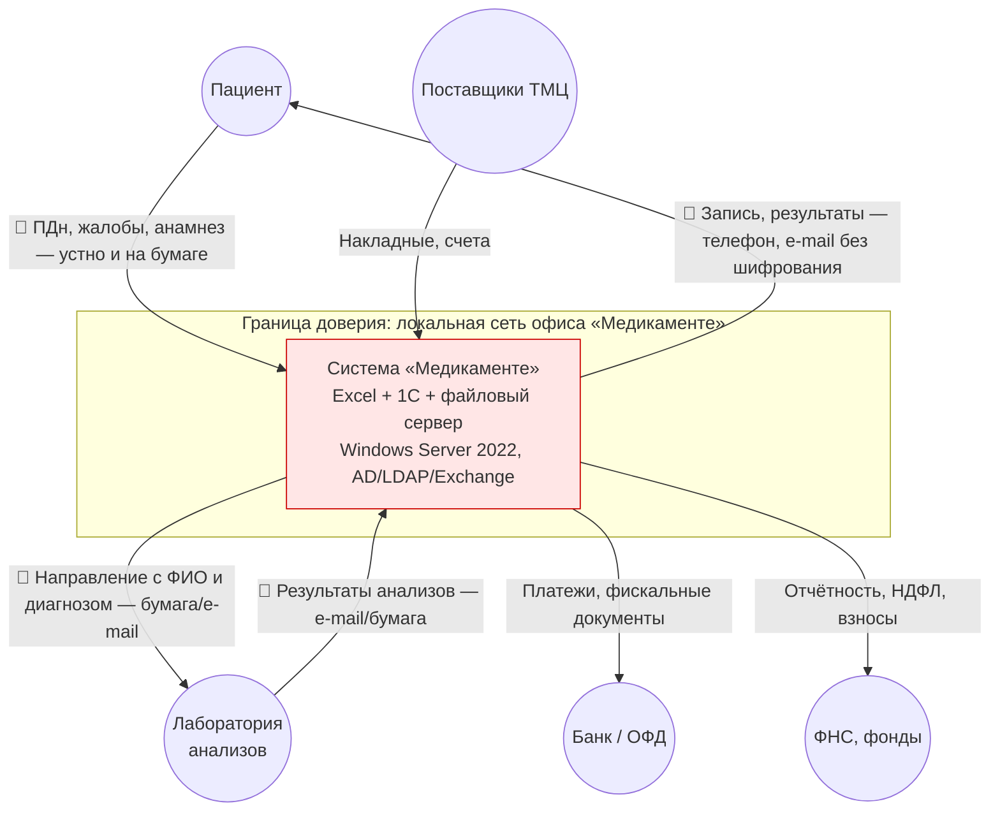
```mermaid
flowchart TB
    PAT(("Пациент"))
    LAB(("Лаборатория<br/>анализов"))
    BANK(("Банк / ОФД"))
    FNS(("ФНС, фонды"))
    SUP(("Поставщики ТМЦ"))

    subgraph TZ["Граница доверия: локальная сеть офиса «Медикаменте»"]
        SYS["Система «Медикаменте»<br/>Excel + 1С + файловый сервер<br/>Windows Server 2022, AD/LDAP/Exchange"]
    end

    PAT -->|"🔴 ПДн, жалобы, анамнез — устно и на бумаге"| SYS
    SYS -->|"🔴 Запись, результаты — телефон, e-mail без шифрования"| PAT
    SYS -->|"🔴 Направление с ФИО и диагнозом — бумага/e-mail"| LAB
    LAB -->|"🔴 Результаты анализов — e-mail/бумага"| SYS
    SYS -->|"Платежи, фискальные документы"| BANK
    SYS -->|"Отчётность, НДФЛ, взносы"| FNS
    SUP -->|"Накладные, счета"| SYS

    style SYS fill:#ffe6e6,stroke:#cc0000
```

Граница доверия одна — «внутри офиса всё своё». Любой субъект внутри периметра (20 административных и 15 медицинских сотрудников, скоро — десятки новых) имеет доступ ко всем категориям данных.

---

## DFD 1 — Запись пациента на приём

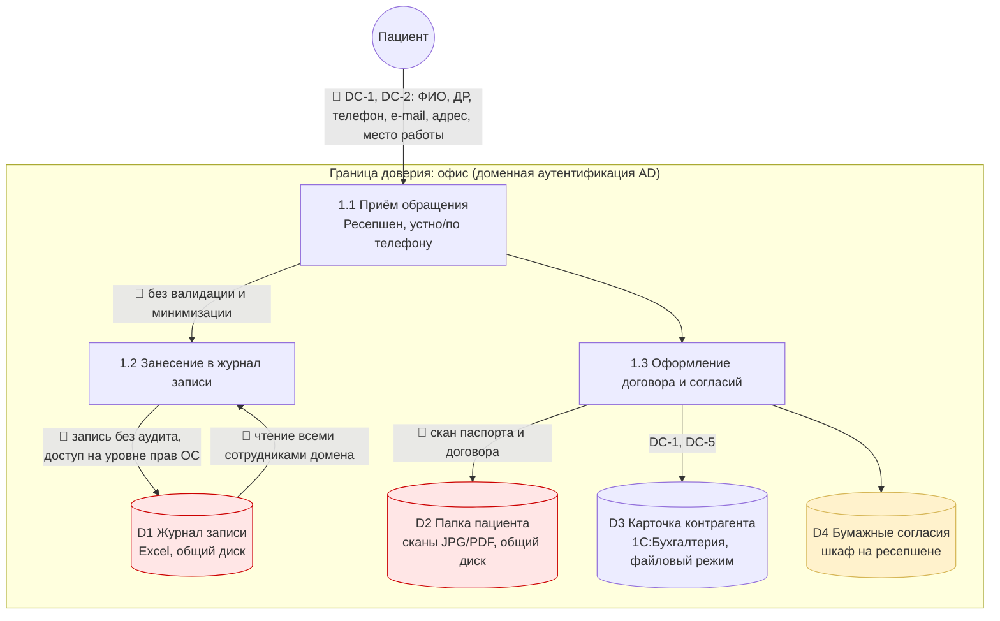
```mermaid
flowchart TB
    PAT(("Пациент"))

    subgraph OFFICE["Граница доверия: офис (доменная аутентификация AD)"]
        P11["1.1 Приём обращения<br/>Ресепшен, устно/по телефону"]
        P12["1.2 Занесение в журнал записи"]
        P13["1.3 Оформление договора и согласий"]
        D1[("D1 Журнал записи<br/>Excel, общий диск")]
        D2[("D2 Папка пациента<br/>сканы JPG/PDF, общий диск")]
        D3[("D3 Карточка контрагента<br/>1С:Бухгалтерия, файловый режим")]
        D4[("D4 Бумажные согласия<br/>шкаф на ресепшене")]
    end

    PAT -->|"🔴 DC-1, DC-2: ФИО, ДР, телефон, e-mail, адрес, место работы"| P11
    P11 -->|"🔴 без валидации и минимизации"| P12
    P12 -->|"🔴 запись без аудита, доступ на уровне прав ОС"| D1
    P11 --> P13
    P13 -->|"🔴 скан паспорта и договора"| D2
    P13 --> D4
    P13 -->|"DC-1, DC-5"| D3
    D1 -->|"🔴 чтение всеми сотрудниками домена"| P12

    style D1 fill:#ffe6e6,stroke:#cc0000
    style D2 fill:#ffe6e6,stroke:#cc0000
    style D4 fill:#fff2cc,stroke:#d6b656
```

- Собираются DC-2 (адрес прописки, место работы) без обоснования цели — нарушение ст. 5 ч. 5 152-ФЗ.
- D1 и D2 доступны любому пользователю домена; разграничение — только NTFS-права, назначаемые вручную.
- Согласия (D4) бумажные и не связаны с записью — отозвать согласие технически невозможно.

---

## DFD 2 — Приём у специалиста и ведение медкарты

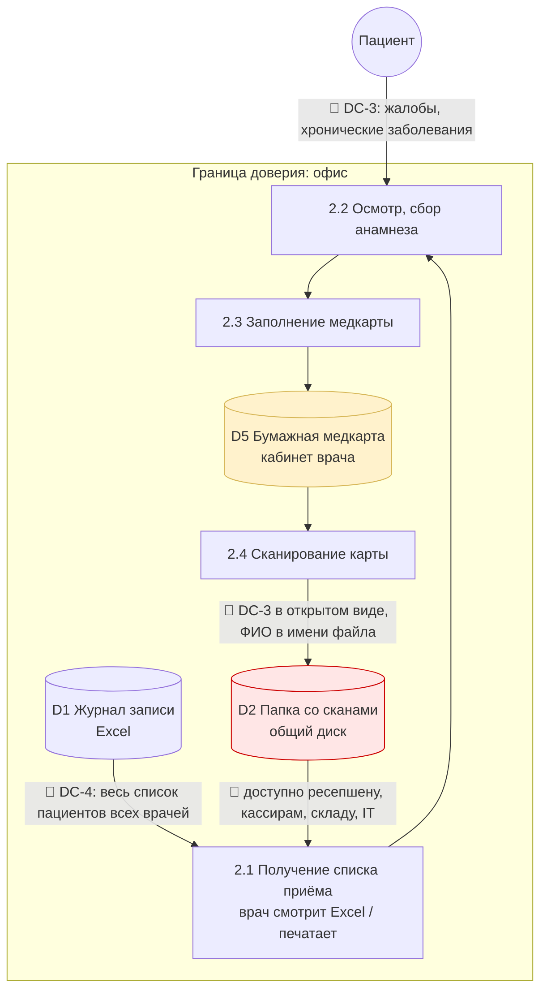
```mermaid
flowchart TB
    PAT(("Пациент"))

    subgraph OFFICE["Граница доверия: офис"]
        D1[("D1 Журнал записи<br/>Excel")]
        P21["2.1 Получение списка приёма<br/>врач смотрит Excel / печатает"]
        P22["2.2 Осмотр, сбор анамнеза"]
        P23["2.3 Заполнение медкарты"]
        P24["2.4 Сканирование карты"]
        D5[("D5 Бумажная медкарта<br/>кабинет врача")]
        D2[("D2 Папка со сканами<br/>общий диск")]
    end

    D1 -->|"🔴 DC-4: весь список пациентов всех врачей"| P21
    P21 --> P22
    PAT -->|"🔴 DC-3: жалобы, хронические заболевания"| P22
    P22 --> P23
    P23 --> D5
    D5 --> P24
    P24 -->|"🔴 DC-3 в открытом виде, ФИО в имени файла"| D2
    D2 -->|"🔴 доступно ресепшену, кассирам, складу, IT"| P21

    style D2 fill:#ffe6e6,stroke:#cc0000
    style D5 fill:#fff2cc,stroke:#d6b656
```

- Врач видит расписание **всех** специалистов → нарушение врачебной тайны внутри организации.
- Сканы медкарт лежат в том же файловом пространстве, что и хозяйственные документы: административный персонал имеет к ним доступ.
- Бумажная карта не имеет учёта выдачи и возврата.

---

## DFD 3 — Назначение анализов и получение результатов

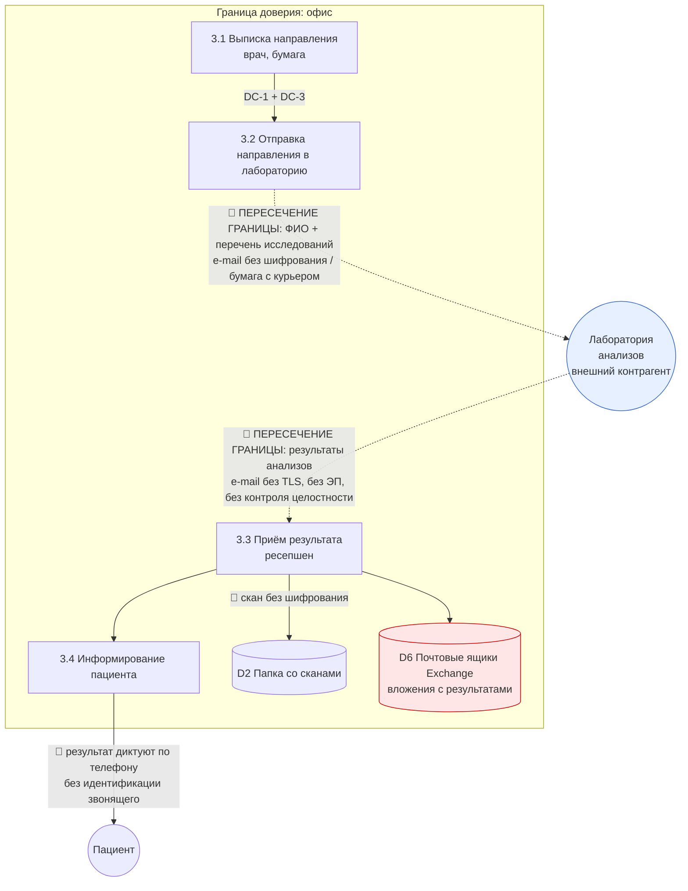
```mermaid
flowchart TB
    LAB(("Лаборатория<br/>анализов<br/>внешний контрагент"))
    PAT(("Пациент"))

    subgraph OFFICE["Граница доверия: офис"]
        P31["3.1 Выписка направления<br/>врач, бумага"]
        P32["3.2 Отправка направления в лабораторию"]
        P33["3.3 Приём результата<br/>ресепшен"]
        P34["3.4 Информирование пациента"]
        D2[("D2 Папка со сканами")]
        D6[("D6 Почтовые ящики Exchange<br/>вложения с результатами")]
    end

    P31 -->|"DC-1 + DC-3"| P32
    P32 -.->|"🔴 ПЕРЕСЕЧЕНИЕ ГРАНИЦЫ: ФИО + перечень исследований<br/>e-mail без шифрования / бумага с курьером"| LAB
    LAB -.->|"🔴 ПЕРЕСЕЧЕНИЕ ГРАНИЦЫ: результаты анализов<br/>e-mail без TLS, без ЭП, без контроля целостности"| P33
    P33 --> D6
    P33 -->|"🔴 скан без шифрования"| D2
    P33 --> P34
    P34 -->|"🔴 результат диктуют по телефону<br/>без идентификации звонящего"| PAT

    style D6 fill:#ffe6e6,stroke:#cc0000
    style LAB fill:#e6f0ff,stroke:#3366cc
```

**Самый опасный поток:**
- Спецкатегория ПДн пересекает границу доверия по открытому каналу — нарушение приказа ФСБ № 378 (СКЗИ при передаче ПДн по незащищённым каналам).
- Нет контроля целостности: подменённый результат анализа необнаружим.
- Результат сообщают по телефону без верификации личности — вектор социальной инженерии.
- Вложения остаются в Exchange навсегда (S-04).

---

## DFD 4 — Оплата услуг

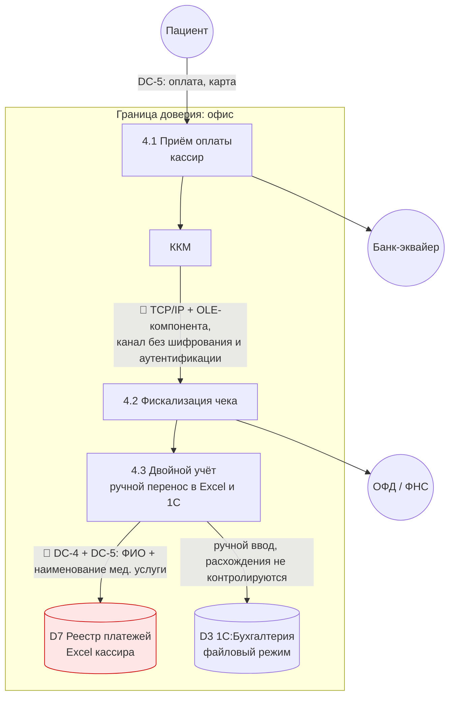
```mermaid
flowchart TB
    PAT(("Пациент"))
    OFD(("ОФД / ФНС"))
    BANK(("Банк-эквайер"))

    subgraph OFFICE["Граница доверия: офис"]
        P41["4.1 Приём оплаты<br/>кассир"]
        P42["4.2 Фискализация чека"]
        P43["4.3 Двойной учёт<br/>ручной перенос в Excel и 1С"]
        KKM["ККМ"]
        D7[("D7 Реестр платежей<br/>Excel кассира")]
        D3[("D3 1С:Бухгалтерия<br/>файловый режим")]
    end

    PAT -->|"DC-5: оплата, карта"| P41
    P41 --> KKM
    KKM -->|"🔴 TCP/IP + OLE-компонента,<br/>канал без шифрования и аутентификации"| P42
    P42 --> OFD
    P41 --> BANK
    P42 --> P43
    P43 -->|"🔴 DC-4 + DC-5: ФИО + наименование мед. услуги"| D7
    P43 -->|"ручной ввод, расхождения не контролируются"| D3

    style D7 fill:#ffe6e6,stroke:#cc0000
```

- Связка ККМ ↔ 1С по OLE поверх TCP/IP без TLS и взаимной аутентификации.
- Реестр платежей содержит связку «ФИО + услуга» (S-11) — фактически раскрывает врачебную тайну кассиру.
- Двойной ручной учёт → расхождения Excel ↔ 1С, нет единого источника правды.

---

## DFD 5 — Бухгалтерия, кадры и зарплата

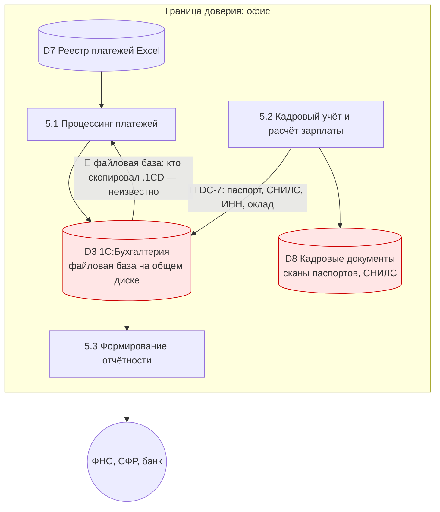
```mermaid
flowchart TB
    FNS(("ФНС, СФР, банк"))

    subgraph OFFICE["Граница доверия: офис"]
        D7[("D7 Реестр платежей Excel")]
        P51["5.1 Процессинг платежей"]
        P52["5.2 Кадровый учёт и расчёт зарплаты"]
        P53["5.3 Формирование отчётности"]
        D3[("D3 1С:Бухгалтерия<br/>файловая база на общем диске")]
        D8[("D8 Кадровые документы<br/>сканы паспортов, СНИЛС")]
    end

    D7 --> P51
    P51 --> D3
    P52 -->|"🔴 DC-7: паспорт, СНИЛС, ИНН, оклад"| D3
    P52 --> D8
    D3 --> P53
    P53 --> FNS
    D3 -->|"🔴 файловая база: кто скопировал .1CD — неизвестно"| P51

    style D3 fill:#ffe6e6,stroke:#cc0000
    style D8 fill:#ffe6e6,stroke:#cc0000
```

Файловая база `.1CD` копируется одним действием любым пользователем с доступом к каталогу — единовременная утечка всех финансовых и кадровых данных без следа в логах.

---

## DFD 6 — Учёт ТМЦ и закупки

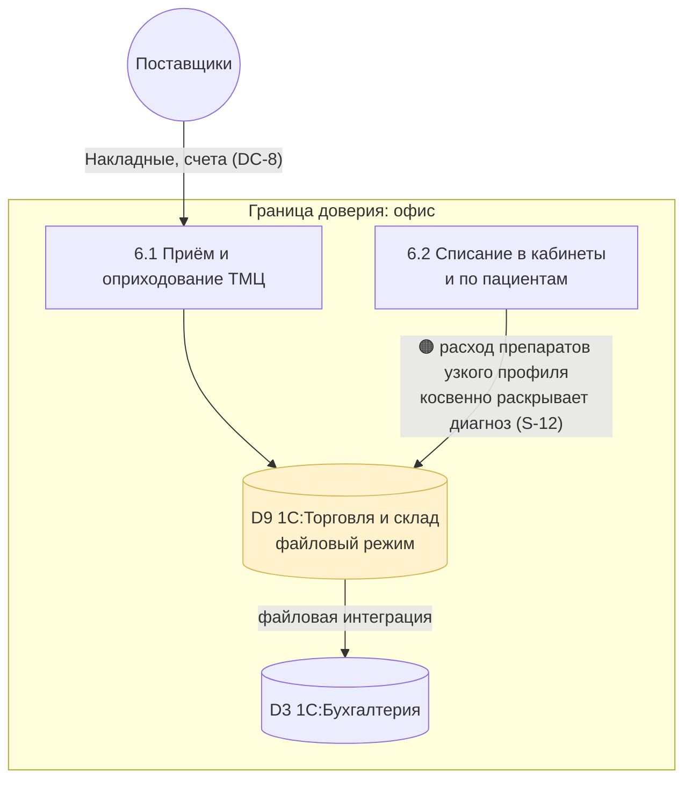
```mermaid
flowchart TB
    SUP(("Поставщики"))

    subgraph OFFICE["Граница доверия: офис"]
        P61["6.1 Приём и оприходование ТМЦ"]
        P62["6.2 Списание в кабинеты<br/>и по пациентам"]
        D9[("D9 1С:Торговля и склад<br/>файловый режим")]
        D3[("D3 1С:Бухгалтерия")]
    end

    SUP -->|"Накладные, счета (DC-8)"| P61
    P61 --> D9
    P62 -->|"🟠 расход препаратов узкого профиля<br/>косвенно раскрывает диагноз (S-12)"| D9
    D9 -->|"файловая интеграция"| D3

    style D9 fill:#fff2cc,stroke:#d6b656
```

Данные списания формально коммерческие (INTERNAL), но в связке с записью на приём восстанавливают медицинскую информацию — классические квази-идентификаторы, которые нужно учитывать при обезличивании.

---

## DFD 7 — Аналитика и отчётность

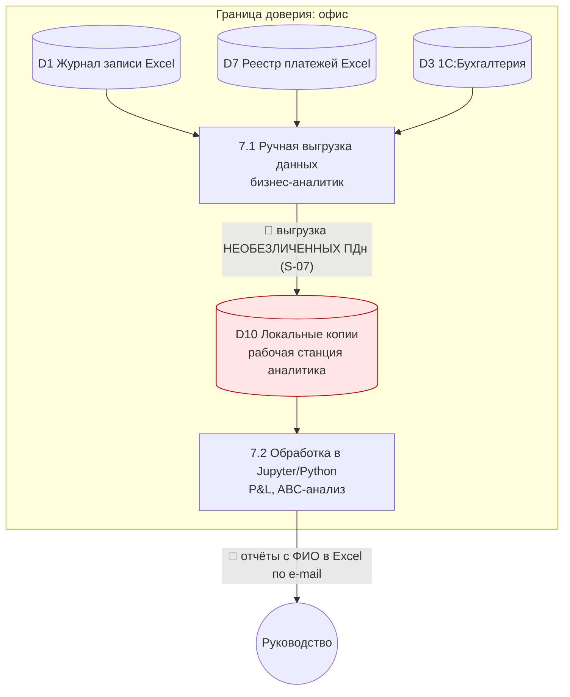
```mermaid
flowchart TB
    MGMT(("Руководство"))

    subgraph OFFICE["Граница доверия: офис"]
        D1[("D1 Журнал записи Excel")]
        D7[("D7 Реестр платежей Excel")]
        D3[("D3 1С:Бухгалтерия")]
        P71["7.1 Ручная выгрузка данных<br/>бизнес-аналитик"]
        D10[("D10 Локальные копии<br/>рабочая станция аналитика")]
        P72["7.2 Обработка в Jupyter/Python<br/>P&L, ABC-анализ"]
    end

    D1 --> P71
    D7 --> P71
    D3 --> P71
    P71 -->|"🔴 выгрузка НЕОБЕЗЛИЧЕННЫХ ПДн (S-07)"| D10
    D10 --> P72
    P72 -->|"🔴 отчёты с ФИО в Excel по e-mail"| MGMT

    style D10 fill:#ffe6e6,stroke:#cc0000
```

Аналитический контур работает с боевыми ПДн на неконтролируемой рабочей станции. Это же место станет входом в будущее озеро данных — без обезличивания на входе проблема перенесётся в BI/ML-контур целиком.

---

## 1.4 Сводная таблица потоков

| ID | Поток | Источник → Приёмник | Категории | Канал | Защита сейчас | Риск |
|----|-------|--------------------|-----------|-------|---------------|------|
| F-01 | Регистрация пациента | Пациент → Ресепшен → D1 | DC-1, DC-2 | Устно, ручной ввод | Нет | 🔴 |
| F-02 | Оформление договора | Ресепшен → D2, D4 | DC-1, DC-6 | Бумага, скан | Нет | 🔴 |
| F-03 | Список приёма | D1 → Врач | DC-4 | Excel/печать | Права NTFS | 🔴 |
| F-04 | Ведение медкарты | Врач → D5 → D2 | DC-3 | Бумага, скан | Нет | 🔴 |
| F-05 | Направление в лабораторию | Врач → Лаборатория | DC-1, DC-3 | E-mail/бумага | Нет | 🔴 |
| F-06 | Результаты анализов | Лаборатория → Ресепшен → D2 | DC-3 | E-mail | Нет TLS, нет ЭП | 🔴 |
| F-07 | Информирование пациента | Ресепшен → Пациент | DC-3, DC-4 | Телефон, SMS, e-mail | Нет идентификации | 🔴 |
| F-08 | Приём платежа | Пациент → ККМ → 1С | DC-5 | TCP/IP + OLE | Нет шифрования | 🔴 |
| F-09 | Двойной учёт платежей | Кассир → D7 + D3 | DC-4, DC-5 | Ручной ввод | Нет | 🔴 |
| F-10 | Кадры и зарплата | Бухгалтерия → D3, D8 | DC-7 | Файловая база | Права NTFS | 🟠 |
| F-11 | Учёт ТМЦ | Склад → D9 → D3 | DC-8, DC-3 косв. | Файловая интеграция | Нет | 🟠 |
| F-12 | Аналитические выгрузки | D1, D3, D7 → D10 | DC-1, DC-3, DC-5 | Ручной экспорт | Нет обезличивания | 🔴 |
| F-13 | Отчётность в госорганы | 1С → ФНС/СФР | DC-7 | ЭДО | ЭП оператора ЭДО | 🟢 |

**13 потоков, 9 критических.** Единственный защищённый поток — регламентированная отчётность, и защиту там обеспечивает внешний оператор ЭДО, а не архитектура компании.

**Data Lineage отсутствует.** На вопрос «где все копии данных пациента Иванова и кто их читал за месяц» ответа нет. Отсюда три невозможности: исполнить ст. 21 152-ФЗ (уничтожение данных), расследовать инцидент и уведомить РКН в течение 24 часов по ст. 21 ч. 3.1 — утечка попросту не будет обнаружена.

---

# Часть 2. Состояние To-Be: потоки с мерами защиты

## Обозначения мер

| Метка | Значение | | Метка | Значение |
|-------|----------|---|-------|----------|
| 🔒 | Шифрование (хранение или передача) | | ✍ | Электронная подпись |
| 🛡 | Проверка доступа (RBAC / ABAC) | | 🎭 | Маскирование или обезличивание |
| 📝 | Запись в аудит-лог | | ⏱ | Политика ретенции / удаления |
| 🏷 | Присвоение или проверка тега классификации | | | |

---

## 2.1 Целевая архитектура защиты

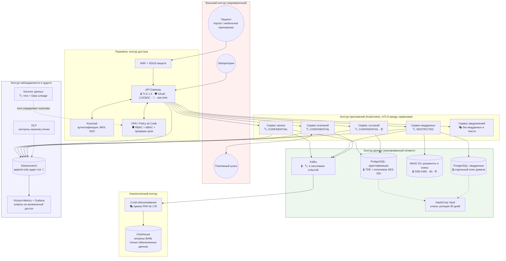
```mermaid
flowchart TB
    subgraph EXT["Внешний контур (недоверенный)"]
        PAT(("Пациент<br/>портал / мобильное приложение"))
        LAB(("Лаборатория"))
        PAY(("Платёжный шлюз"))
    end

    subgraph EDGE["Периметр: контур доступа"]
        WAF["WAF + DDoS-защита"]
        GW["API Gateway<br/>🔒 TLS 1.3 · 🛡 OAuth 2.0/OIDC · 📝 · rate limit"]
        IDP["Keycloak<br/>аутентификация, MFA, SSO"]
        OPA["OPA / Policy as Code<br/>🛡 RBAC + ABAC + проверка цели"]
    end

    subgraph APP["Контур приложений (Kubernetes, mTLS между сервисами)"]
        S1["Сервис записи<br/>🏷 CONFIDENTIAL"]
        S2["Сервис медданных<br/>🏷 RESTRICTED"]
        S3["Сервис платежей<br/>🏷 CONFIDENTIAL"]
        S4["Сервис согласий<br/>🏷 CONFIDENTIAL · ⏱"]
        S5["Сервис уведомлений<br/>🎭 без медданных в тексте"]
    end

    subgraph DATA["Контур данных (изолированный сегмент)"]
        DB1[("PostgreSQL: идентификация<br/>🔒 TDE + пополевое AES-256")]
        DB2[("PostgreSQL: медданные<br/>🔒 отдельный ключ домена")]
        OBJ[("MinIO S3: документы и сканы<br/>🔒 SSE-KMS · ✍ · ⏱")]
        VAULT["HashiCorp Vault<br/>ключи, ротация 90 дней"]
        KAFKA["Kafka<br/>🔒 · 🏷 в заголовках событий"]
    end

    subgraph ANALYTICS["Аналитический контур"]
        ANON["Слой обезличивания<br/>🎭 приказ РКН № 178"]
        CH[("ClickHouse<br/>витрины BI/ML<br/>только обезличенные данные")]
    end

    subgraph SEC["Контур наблюдаемости и аудита"]
        LOG[("Elasticsearch<br/>append-only аудит-лог 📝")]
        MON["Victoria Metrics + Grafana<br/>алерты на аномальный доступ"]
        CAT["Каталог данных<br/>🏷 теги + Data Lineage"]
        DLP["DLP<br/>контроль каналов утечки"]
    end

    PAT --> WAF --> GW
    LAB --> GW
    GW <--> IDP
    GW <--> OPA
    GW --> S1 & S2 & S3 & S4 & S5
    S3 <--> PAY
    S1 --> DB1
    S2 --> DB2
    S2 --> OBJ
    S4 --> DB1
    S1 & S2 & S3 --> KAFKA
    DB1 & DB2 -.-> VAULT
    KAFKA --> ANON --> CH
    S1 & S2 & S3 & S4 & GW --> LOG
    LOG --> MON
    CAT -.->|"теги определяют политики"| OPA
    DLP -.-> LOG

    style DATA fill:#eef7ee,stroke:#2d7a2d
    style SEC fill:#f2f2ff,stroke:#4444aa
    style EXT fill:#fff0f0,stroke:#cc6666
```

**Четыре ключевых решения:**
1. **Множественные границы доверия** вместо одной. Каждое пересечение — точка аутентификации, авторизации и аудита.
2. **Разделение доменов данных.** Идентификационные и медицинские данные хранятся раздельно, под разными ключами: компрометация одного домена не раскрывает пациента целиком.
3. **Теги управляют защитой.** Каталог данных передаёт теги в OPA, политики применяются автоматически — в том числе к новым интеграциям, которые не требуется перевалидировать.
4. **Аналитика получает только обезличенные данные** — обезличивание на входе в озеро, а не на выходе из него.

---

## 2.2 DFD 1 (To-Be) — Запись пациента

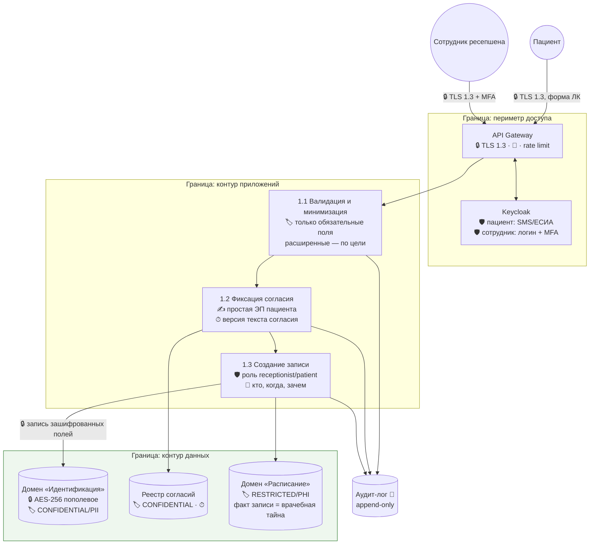
```mermaid
flowchart TB
    PAT(("Пациент"))
    REC(("Сотрудник ресепшена"))

    subgraph EDGE["Граница: периметр доступа"]
        GW["API Gateway<br/>🔒 TLS 1.3 · 📝 · rate limit"]
        AUTH["Keycloak<br/>🛡 пациент: SMS/ЕСИА<br/>🛡 сотрудник: логин + MFA"]
    end

    subgraph APP["Граница: контур приложений"]
        P11["1.1 Валидация и минимизация<br/>🏷 только обязательные поля<br/>расширенные — по цели"]
        P12["1.2 Фиксация согласия<br/>✍ простая ЭП пациента<br/>⏱ версия текста согласия"]
        P13["1.3 Создание записи<br/>🛡 роль receptionist/patient<br/>📝 кто, когда, зачем"]
    end

    subgraph DATA["Граница: контур данных"]
        DB1[("Домен «Идентификация»<br/>🔒 AES-256 пополевое<br/>🏷 CONFIDENTIAL/PII")]
        DB4[("Реестр согласий<br/>🏷 CONFIDENTIAL · ⏱")]
        DB2[("Домен «Расписание»<br/>🏷 RESTRICTED/PHI<br/>факт записи = врачебная тайна")]
    end

    LOG[("Аудит-лог 📝<br/>append-only")]

    PAT -->|"🔒 TLS 1.3, форма ЛК"| GW
    REC -->|"🔒 TLS 1.3 + MFA"| GW
    GW <--> AUTH
    GW --> P11
    P11 --> P12 --> P13
    P13 -->|"🔒 запись зашифрованных полей"| DB1
    P12 --> DB4
    P13 --> DB2
    P11 & P12 & P13 --> LOG

    style DATA fill:#eef7ee,stroke:#2d7a2d
```

| Этап потока | Мера защиты | Инструмент |
|-------------|-------------|------------|
| Ввод данных | TLS 1.3, серверная валидация, минимизация полей | API Gateway, OpenAPI с тегами |
| Аутентификация | Пациент — SMS/ЕСИА; сотрудник — логин + MFA | Keycloak |
| Авторизация | RBAC: `receptionist` создаёт записи, `patient` — только свои | OPA |
| Согласие | Версия текста, цели, канал, время, простая ЭП | Сервис согласий |
| Хранение | Пополевое AES-256-GCM, ключ в Vault, домены разделены | PostgreSQL + pgcrypto + Vault |
| Аудит и ретенция | Субъект, ресурс, тег, цель, результат; срок из тега | Elasticsearch, сервис ретенции |

Исчезли Excel-журнал и бумажный шкаф согласий; вместо прав NTFS — проверка на каждом запросе; появился след для расследования и техническая возможность отозвать согласие.

---

## 2.3 DFD 2 (To-Be) — Приём у специалиста

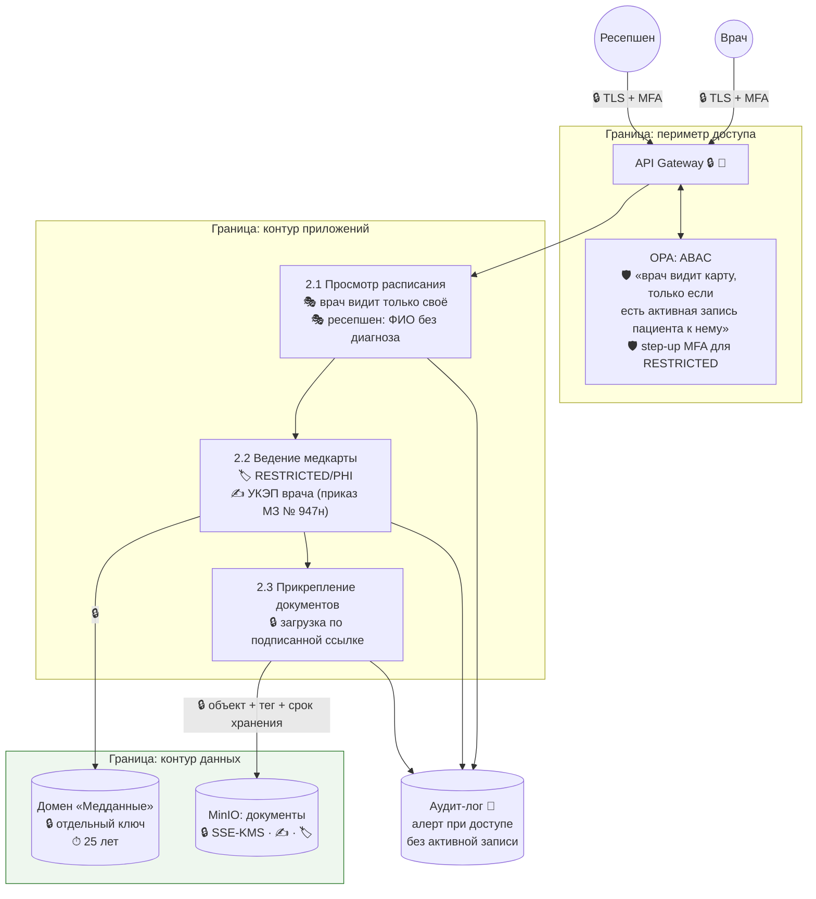
```mermaid
flowchart TB
    DOC(("Врач"))
    REC(("Ресепшен"))

    subgraph EDGE["Граница: периметр доступа"]
        GW["API Gateway 🔒 📝"]
        OPA["OPA: ABAC<br/>🛡 «врач видит карту, только если<br/>есть активная запись пациента к нему»<br/>🛡 step-up MFA для RESTRICTED"]
    end

    subgraph APP["Граница: контур приложений"]
        P21["2.1 Просмотр расписания<br/>🎭 врач видит только своё<br/>🎭 ресепшен: ФИО без диагноза"]
        P22["2.2 Ведение медкарты<br/>🏷 RESTRICTED/PHI<br/>✍ УКЭП врача (приказ МЗ № 947н)"]
        P23["2.3 Прикрепление документов<br/>🔒 загрузка по подписанной ссылке"]
    end

    subgraph DATA["Граница: контур данных"]
        DB2[("Домен «Медданные»<br/>🔒 отдельный ключ<br/>⏱ 25 лет")]
        OBJ[("MinIO: документы<br/>🔒 SSE-KMS · ✍ · 🏷")]
    end

    LOG[("Аудит-лог 📝<br/>алерт при доступе<br/>без активной записи")]

    DOC -->|"🔒 TLS + MFA"| GW
    REC -->|"🔒 TLS + MFA"| GW
    GW <--> OPA
    GW --> P21 --> P22 --> P23
    P22 -->|"🔒"| DB2
    P23 -->|"🔒 объект + тег + срок хранения"| OBJ
    P21 & P22 & P23 --> LOG

    style DATA fill:#eef7ee,stroke:#2d7a2d
```

| Этап потока | Мера защиты | Что это даёт |
|-------------|-------------|--------------|
| Просмотр расписания | Фильтрация по врачу; ресепшену — представление без диагноза | Исполнение ст. 13 323-ФЗ внутри организации |
| Открытие медкарты | ABAC «активная запись» + step-up MFA | Врач не откроет карту произвольного пациента |
| Запись в карту | УКЭП врача | Юридическая значимость и контроль целостности |
| Хранение | Отдельный домен и ключ шифрования | Компрометация контура записи не раскрывает диагнозы |
| Документы | Доступ только по временной подписанной ссылке | Прямой доступ к файлам невозможен |
| Аудит | Алерт на доступ вне активной записи и на массовое чтение карт | Выявление нетипичных действий |

---

## 2.4 DFD 3 (To-Be) — Интеграция с лабораторией через API

Самый критичный поток As-Is становится самым контролируемым.

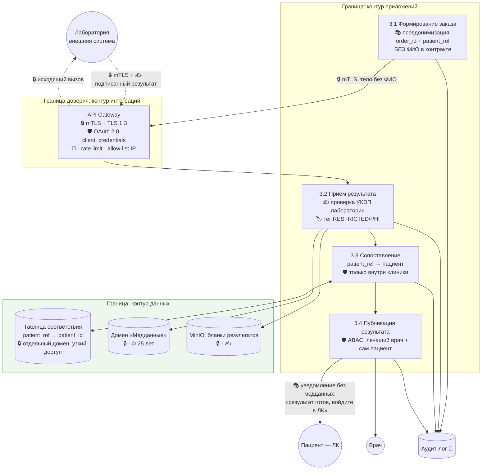
```mermaid
flowchart TB
    LAB(("Лаборатория<br/>внешняя система"))
    DOC(("Врач"))
    PAT(("Пациент — ЛК"))

    subgraph EDGE["Граница доверия: контур интеграций"]
        GW["API Gateway<br/>🔒 mTLS + TLS 1.3<br/>🛡 OAuth 2.0 client_credentials<br/>📝 · rate limit · allow-list IP"]
    end

    subgraph APP["Граница: контур приложений"]
        P31["3.1 Формирование заказа<br/>🎭 псевдонимизация:<br/>order_id + patient_ref<br/>БЕЗ ФИО в контракте"]
        P32["3.2 Приём результата<br/>✍ проверка УКЭП лаборатории<br/>🏷 тег RESTRICTED/PHI"]
        P33["3.3 Сопоставление<br/>patient_ref → пациент<br/>🛡 только внутри клиники"]
        P34["3.4 Публикация результата<br/>🛡 ABAC: лечащий врач + сам пациент"]
    end

    subgraph DATA["Граница: контур данных"]
        MAP[("Таблица соответствия<br/>patient_ref ↔ patient_id<br/>🔒 отдельный домен, узкий доступ")]
        DB2[("Домен «Медданные»<br/>🔒 · ⏱ 25 лет")]
        OBJ[("MinIO: бланки результатов<br/>🔒 · ✍")]
    end

    LOG[("Аудит-лог 📝")]

    P31 -->|"🔒 mTLS, тело без ФИО"| GW
    GW -.->|"🔒 исходящий вызов"| LAB
    LAB -.->|"🔒 mTLS + ✍ подписанный результат"| GW
    GW --> P32 --> P33 --> P34
    P33 <--> MAP
    P32 --> DB2
    P32 --> OBJ
    P34 -->|"🎭 уведомление без медданных:<br/>«результат готов, войдите в ЛК»"| PAT
    P34 --> DOC
    P31 & P32 & P33 & P34 --> LOG

    style DATA fill:#eef7ee,stroke:#2d7a2d
```

Как поток закрывает цель бизнеса №1:

| Требование задания | Реализация |
|--------------------|------------|
| API-контракты закрывают конфиденциальные категории | В контракт уходит `order_id` + `patient_ref` + код исследования; ФИО, дата рождения и контакты не покидают клинику |
| Третьи лица не получают лишних данных | mTLS + OAuth 2.0 с ограниченным scope; лаборатория видит только свои заказы |
| Пациент не видит данные другого пациента | ABAC-правило `subject.patient_ref == resource.patient_ref` на выдаче в ЛК |
| Новые интеграции не нужно перевалидировать | Политика привязана к тегу данных, а не к коду интеграции |
| Целостность и подлинность | УКЭП лаборатории (63-ФЗ), проверка подписи до записи в домен медданных |
| Уведомление пациента | В канале нет медицинских сведений — только приглашение войти в ЛК |

---

## 2.5 DFD 4 (To-Be) — Оплата услуг

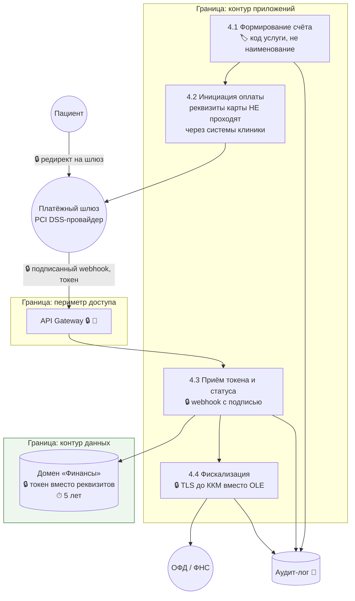
```mermaid
flowchart TB
    PAT(("Пациент"))
    PSP(("Платёжный шлюз<br/>PCI DSS-провайдер"))
    OFD(("ОФД / ФНС"))

    subgraph EDGE["Граница: периметр доступа"]
        GW["API Gateway 🔒 📝"]
    end

    subgraph APP["Граница: контур приложений"]
        P41["4.1 Формирование счёта<br/>🏷 код услуги, не наименование"]
        P42["4.2 Инициация оплаты<br/>реквизиты карты НЕ проходят<br/>через системы клиники"]
        P43["4.3 Приём токена и статуса<br/>🔒 webhook с подписью"]
        P44["4.4 Фискализация<br/>🔒 TLS до ККМ вместо OLE"]
    end

    subgraph DATA["Граница: контур данных"]
        DB3[("Домен «Финансы»<br/>🔒 токен вместо реквизитов<br/>⏱ 5 лет")]
    end

    LOG[("Аудит-лог 📝")]

    PAT -->|"🔒 редирект на шлюз"| PSP
    PSP -->|"🔒 подписанный webhook, токен"| GW
    GW --> P43
    P41 --> P42 --> PSP
    P43 --> DB3
    P43 --> P44 --> OFD
    P41 & P43 & P44 --> LOG

    style DATA fill:#eef7ee,stroke:#2d7a2d
```

| Проблема As-Is | Решение To-Be |
|----------------|---------------|
| Реквизиты карт могут оседать в Excel | Токенизация: реквизиты обрабатывает только PCI DSS-провайдер → компания выходит из области действия стандарта |
| Канал ККМ ↔ 1С по OLE без шифрования | TLS-соединение с ККМ, взаимная аутентификация, отказ от OLE |
| Двойной ручной учёт | Единый источник правды — сервис платежей; в 1С данные попадают через API |
| Кассир видит наименование мед. услуги | В интерфейсе кассира — код услуги и сумма; расшифровка только медперсоналу |

---

## 2.6 DFD 7 (To-Be) — Аналитика и озеро данных

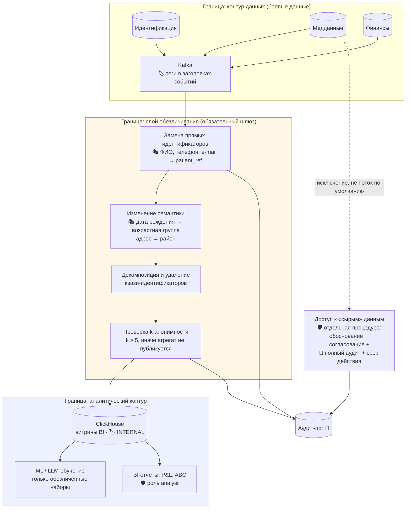
```mermaid
flowchart TB
    subgraph DATA["Граница: контур данных (боевые данные)"]
        DB1[("Идентификация")]
        DB2[("Медданные")]
        DB3[("Финансы")]
        KAFKA["Kafka<br/>🏷 теги в заголовках событий"]
    end

    subgraph ANON["Граница: слой обезличивания (обязательный шлюз)"]
        A1["Замена прямых идентификаторов<br/>🎭 ФИО, телефон, e-mail → patient_ref"]
        A2["Изменение семантики<br/>🎭 дата рождения → возрастная группа<br/>адрес → район"]
        A3["Декомпозиция и удаление<br/>квази-идентификаторов"]
        A4["Проверка k-анонимности<br/>k ≥ 5, иначе агрегат не публикуется"]
    end

    subgraph LAKE["Граница: аналитический контур"]
        CH[("ClickHouse<br/>витрины BI · 🏷 INTERNAL")]
        ML["ML / LLM-обучение<br/>только обезличенные наборы"]
        BI["BI-отчёты: P&L, ABC<br/>🛡 роль analyst"]
    end

    RAW["Доступ к «сырым» данным<br/>🛡 отдельная процедура:<br/>обоснование + согласование +<br/>📝 полный аудит + срок действия"]
    LOG[("Аудит-лог 📝")]

    DB1 & DB2 & DB3 --> KAFKA --> A1 --> A2 --> A3 --> A4 --> CH
    CH --> ML
    CH --> BI
    DB2 -.->|"исключение, не поток по умолчанию"| RAW
    RAW --> LOG
    A1 & A4 --> LOG

    style ANON fill:#fff7e6,stroke:#cc9900,stroke-width:2px
    style LAKE fill:#eef2ff,stroke:#4444aa
```

Обезличивание — обязательный шлюз, а не опция. ПДн физически не попадают в аналитический контур, поэтому витрины BI и обучающие наборы для ML/LLM не расширяют область утечки, а цель бизнеса №2 достигается без нового compliance-риска.

---

## 2.7 DFD 8 (To-Be, новый процесс) — Права субъекта и удаление данных

Процесса не существовало в As-Is; он обязателен по ст. 21 152-ФЗ.

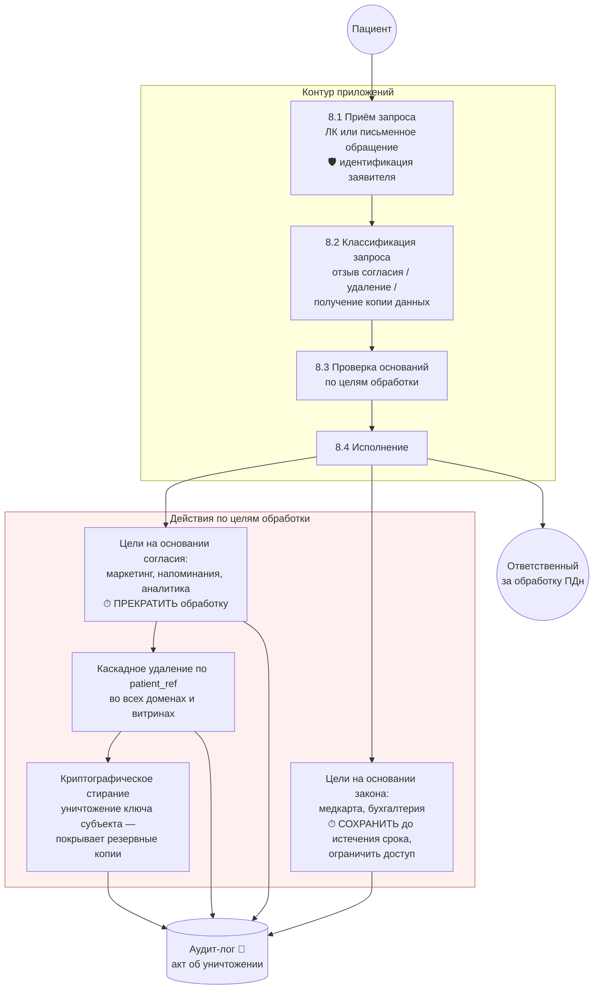
```mermaid
flowchart TB
    PAT(("Пациент"))
    DPO(("Ответственный<br/>за обработку ПДн"))

    subgraph APP["Контур приложений"]
        P81["8.1 Приём запроса<br/>ЛК или письменное обращение<br/>🛡 идентификация заявителя"]
        P82["8.2 Классификация запроса<br/>отзыв согласия / удаление /<br/>получение копии данных"]
        P83["8.3 Проверка оснований<br/>по целям обработки"]
        P84["8.4 Исполнение"]
    end

    subgraph EXEC["Действия по целям обработки"]
        E1["Цели на основании согласия:<br/>маркетинг, напоминания, аналитика<br/>⏱ ПРЕКРАТИТЬ обработку"]
        E2["Цели на основании закона:<br/>медкарта, бухгалтерия<br/>⏱ СОХРАНИТЬ до истечения срока,<br/>ограничить доступ"]
        E3["Каскадное удаление по patient_ref<br/>во всех доменах и витринах"]
        E4["Криптографическое стирание<br/>уничтожение ключа субъекта —<br/>покрывает резервные копии"]
    end

    LOG[("Аудит-лог 📝<br/>акт об уничтожении")]

    PAT --> P81 --> P82 --> P83 --> P84
    P84 --> E1
    P84 --> E2
    E1 --> E3 --> E4
    P84 --> DPO
    E1 & E2 & E3 & E4 --> LOG

    style EXEC fill:#fff0f0,stroke:#cc6666
```

**Почему исполнение дифференцировано по целям.** Безусловное удаление всех данных пациента нарушило бы приказ МЗ № 530н (медкарта хранится 25 лет) и требования бухгалтерского учёта. Поэтому отзыв согласия останавливает обработку по целям, основанным на согласии, а данные, обрабатываемые на основании закона, сохраняются с ограничением доступа до истечения нормативного срока. Криптографическое стирание решает проблему резервных копий, из которых удалить одну запись физически невозможно.

---

## 2.8 DFD 9 (To-Be, новый процесс) — Мониторинг, аудит и реагирование

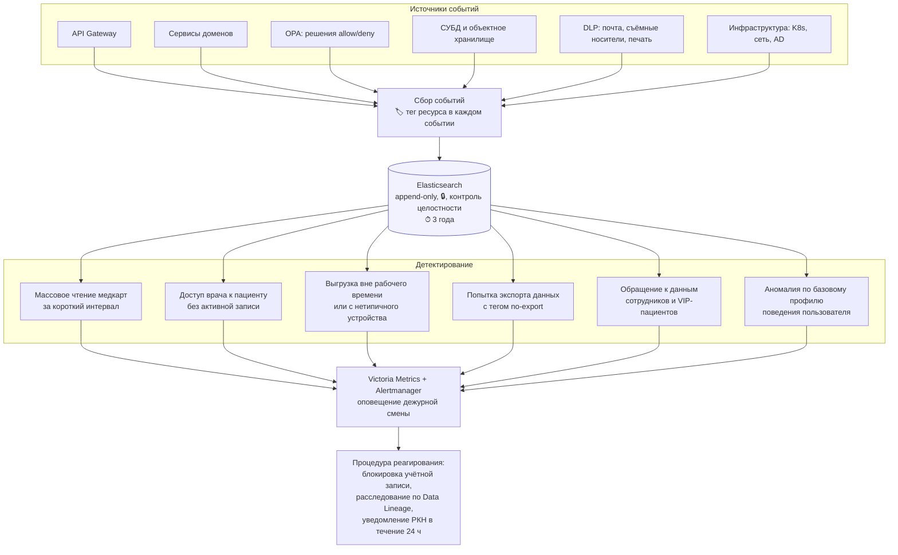
```mermaid
flowchart TB
    subgraph SRC["Источники событий"]
        S1["API Gateway"]
        S2["Сервисы доменов"]
        S3["OPA: решения allow/deny"]
        S4["СУБД и объектное хранилище"]
        S5["DLP: почта, съёмные носители, печать"]
        S6["Инфраструктура: K8s, сеть, AD"]
    end

    COL["Сбор событий<br/>🏷 тег ресурса в каждом событии"]
    LOG[("Elasticsearch<br/>append-only, 🔒, контроль целостности<br/>⏱ 3 года")]

    subgraph DET["Детектирование"]
        D1["Массовое чтение медкарт<br/>за короткий интервал"]
        D2["Доступ врача к пациенту<br/>без активной записи"]
        D3["Выгрузка вне рабочего времени<br/>или с нетипичного устройства"]
        D4["Попытка экспорта данных<br/>с тегом no-export"]
        D5["Обращение к данным<br/>сотрудников и VIP-пациентов"]
        D6["Аномалия по базовому профилю<br/>поведения пользователя"]
    end

    ALERT["Victoria Metrics + Alertmanager<br/>оповещение дежурной смены"]
    IR["Процедура реагирования:<br/>блокировка учётной записи,<br/>расследование по Data Lineage,<br/>уведомление РКН в течение 24 ч"]

    S1 & S2 & S3 & S4 & S5 & S6 --> COL --> LOG
    LOG --> D1 & D2 & D3 & D4 & D5 & D6
    D1 & D2 & D3 & D4 & D5 & D6 --> ALERT --> IR

    style LOG fill:#f2f2ff,stroke:#4444aa
```

Процесс закрывает требования финального состояния: аудит доступа к данным, отслеживание нетипичных действий и оповещение команды при несанкционированном доступе. Он же делает исполнимым требование ст. 21 ч. 3.1 152-ФЗ об уведомлении РКН в течение 24 часов.

---

## 2.9 Сводка преобразований

| Аспект | As-Is | To-Be |
|--------|-------|-------|
| Границы доверия | Одна — периметр офиса | Пять контуров с контролем на каждом переходе |
| Хранение медданных | Сканы и Excel на общем диске | PostgreSQL + MinIO, шифрование, отдельный ключ домена |
| Доступ | Права NTFS для всего домена | RBAC + ABAC, проверка на каждом запросе, MFA |
| Канал с лабораторией | Открытый e-mail | mTLS + OAuth 2.0 + псевдонимизация + УКЭП |
| Платежи | Двойной ручной учёт, OLE без TLS | Токенизация, платёжный шлюз, единый источник правды |
| Классификация | Отсутствует | Теги на всех уровнях, режим fail-closed |
| Аудит | Отсутствует | Append-only лог всех операций с тегом ресурса |
| Data Lineage | Обрывается на первой копии | Сквозной, от формы до витрины BI |
| Аналитика | Боевые ПДн на рабочей станции | Обязательный слой обезличивания на входе в озеро |
| Удаление данных | Невозможно | Дифференцировано по целям + криптографическое стирание |
| Обнаружение инцидентов | Не произойдёт | Детекторы аномалий, алертинг, уведомление РКН |
| Рост на филиалы | Умножает риски | Филиал — атрибут в ABAC, а не новый файловый сервер |
