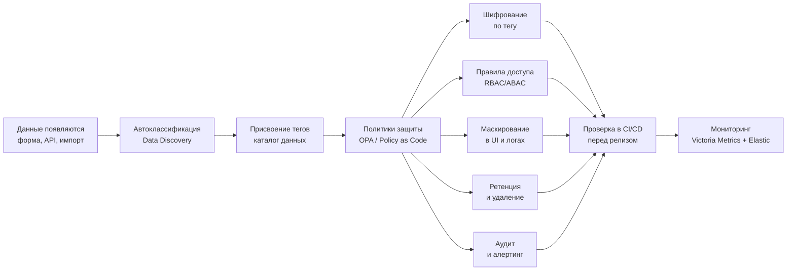
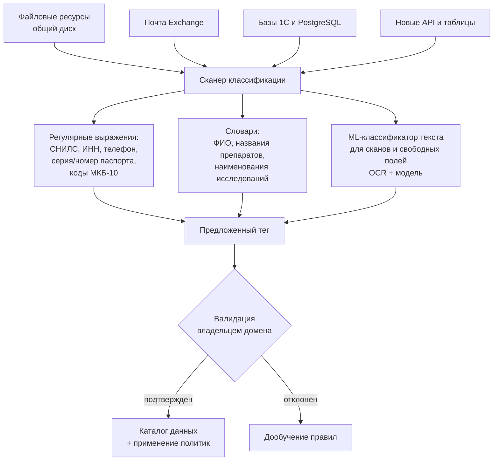

# Аудит безопасности данных и список проблемных зон «Медикаменте»

Аудит текущих мер защиты по требованиям законодательства РФ, перечень проблемных зон, способы защиты данных и механизм тегирования.

Диаграммы потоков данных — в [Data_Flows.md](Data_Flows.md).

---

# Часть 1. Аудит мер по обеспечению безопасности

## 1.1 Нормативная база

Компания обслуживает пациентов на территории РФ, поэтому аудит проводится по требованиям российского законодательства, дополненным международными практиками.

| Документ | Ключевые требования | Выполнение |
|----------|---------------------|-----------|
| **152-ФЗ, ст. 5** | Законность, ограничение цели, **минимизация**, точность, ограничение срока хранения | ❌ |
| **152-ФЗ, ст. 9** | Конкретное информированное согласие; ч. 4 — **письменная форма** для спецкатегорий | ❌ |
| **152-ФЗ, ст. 10** | Спецкатегории ПДн (**состояние здоровья**) — обработка только по исчерпывающим основаниям | ⚠️ Основание есть, режим не обеспечен |
| **152-ФЗ, ст. 18 ч. 5** | **Локализация**: БД с ПДн граждан РФ — на территории РФ | ⚠️ Фактически да, документально не зафиксировано |
| **152-ФЗ, ст. 18.1** | Ответственный за организацию обработки, политика, внутренний контроль, **оценка вреда**, ознакомление сотрудников | ❌ |
| **152-ФЗ, ст. 19** | Определение угроз, СЗИ с оценкой соответствия, учёт носителей, **обнаружение фактов НСД**, восстановление, правила доступа, контроль эффективности | ❌ |
| **152-ФЗ, ст. 21** | Уничтожение ПДн при достижении цели или отзыве согласия (до 30 дней); **ч. 3.1 — уведомление РКН об инциденте за 24 часа**, о расследовании — 72 часа | ❌ Технически неисполнимо |
| **ПП РФ № 1119** | Уровень защищённости по категории ПДн, типу угроз и числу субъектов. Для спецкатегорий при угрозах 3-го типа: **УЗ-3** до 100 000 субъектов, **УЗ-2** свыше | ❌ Не определён |
| **Приказ ФСТЭК № 21** | Меры по группам: ИАФ, УПД, РСБ, АНЗ, ЗИС, ОЦЛ | ❌ Ни одна группа |
| **Приказ ФСБ № 378** | СКЗИ при передаче ПДн по незащищённым каналам связи | ❌ Открытый e-mail с результатами анализов |
| **Приказ РКН № 178** | Методы обезличивания: введение идентификаторов, изменение состава и семантики, декомпозиция, перемешивание | ❌ Не применяется |
| **323-ФЗ, ст. 13** | **Врачебная тайна**: факт обращения, состояние здоровья, диагноз. Запрет разглашения, включая лиц внутри организации, не участвующих в оказании помощи | ❌ |
| **Приказ Минздрава № 947н, 63-ФЗ** | Медицинская документация в электронной форме подписывается УКЭП | ❌ Сканы без ЭП юридически ничтожны |
| **Приказ Минздрава № 530н** | Сроки хранения меддокументации (амбулаторная карта — 25 лет) | ❌ Сроки не определены |
| **54-ФЗ, PCI DSS** | Фискализация расчётов; защита данных карт — оптимально вывести компанию из области действия стандарта | ⚠️ Требует проверки |

**Ответственность.** С 30.05.2025 (ФЗ № 420-ФЗ) ст. 13.11 КоАП устанавливает штраф за утечку ПДн для юрлиц: **3–5 млн ₽** (1 000–10 000 субъектов), **5–10 млн ₽** (10 000–100 000), **10–15 млн ₽** (свыше 100 000); за повторную — **оборотный штраф 1–3 % выручки** (от 20 до 500 млн ₽). Нарушение локализации — 1–6 млн ₽. Введена уголовная ответственность по ст. 272.1 УК РФ. Отдельно — иски пациентов о компенсации морального вреда за разглашение врачебной тайны.

> При нынешней базе одной клиники утечка попадает в диапазон 3–10 млн ₽. После открытия филиалов и запуска мобильного приложения база выйдет за 100 000 субъектов — цена одной утечки становится 10–15 млн ₽. **Стоимость риска растёт быстрее, чем бизнес.**

## 1.2 Аудит архитектурных практик

**Privacy by Design — 0,5 из 7.**

| Принцип | Оценка | Обоснование |
|---------|--------|-------------|
| Проактивность вместо реактивности | ❌ | Меры защиты не проектировались; реакция на инцидент не предусмотрена |
| Приватность по умолчанию | ❌ | По умолчанию данные доступны всем сотрудникам домена |
| Приватность встроена в архитектуру | ❌ | Архитектура — «файлы на общем диске», встраивать защиту некуда |
| Полная функциональность | ⚠️ | Бизнес работает ценой полного отсутствия защиты |
| Сквозная защита жизненного цикла | ❌ | Нет защиты ни при сборе, ни при хранении, ни при удалении |
| Прозрачность и подотчётность | ❌ | Нет журналов, соответствие требованиям недоказуемо |
| Уважение приватности пользователя | ❌ | Пациент не знает, кто видел его данные; отозвать согласие нельзя |

**Data Minimization — нарушен по 4 позициям.**

| Данные | Цель | Вердикт |
|--------|------|---------|
| ФИО, дата рождения, телефон, e-mail | Идентификация, медкарта, уведомления | ✅ Обосновано |
| Адрес прописки | В процессах не используется | ❌ Избыточно — собирается по умолчанию |
| Место работы / учёбы | Не используется, нужно только для ДМС и справок | ❌ Избыточно |
| Скан паспорта | Достаточно сверки и фиксации реквизитов | ❌ Избыточно — хранение скана не обосновано |
| Наименование услуги в реестре кассира | Достаточно кода услуги и суммы | ❌ Избыточно — раскрывает врачебную тайну кассиру |
| Хронические заболевания | Оказание помощи | ⚠️ Собирается верно, хранится незаконно |

**Data Lineage — отсутствует полностью.** Неизвестны все места хранения каждой категории, путь данных обрывается на первой ручной копии, обращения не фиксируются, отчёт «все данные субъекта X» построить невозможно. Это блокирует одновременно compliance (ст. 21 152-ФЗ) и цель бизнеса №2: нельзя строить доверенную аналитику на данных с неизвестным происхождением.

## 1.3 Сопоставление процессов с требованиями

| Процесс (DFD) | Требование | Норма | Разрыв |
|---------------|------------|-------|--------|
| DFD 1. Запись пациента | Согласие в письменной форме, реестр согласий | 152-ФЗ ст. 9 | Бумажные согласия без связи с записями, отзыв неисполним |
| DFD 1 | Минимизация состава данных | 152-ФЗ ст. 5 ч. 5 | Избыточные поля анкеты |
| DFD 1, 2 | Разграничение доступа | ФСТЭК № 21 (УПД) | Доступ = права NTFS для всего домена |
| DFD 2 | Врачебная тайна внутри организации | 323-ФЗ ст. 13 | Немедицинский персонал видит диагнозы |
| DFD 2 | Меддокументация подписывается ЭП | № 947н, 63-ФЗ | Сканы без ЭП не имеют юридической значимости |
| DFD 3 | СКЗИ при передаче по незащищённым каналам | ФСБ № 378 | Открытый e-mail с результатами анализов |
| DFD 3 | Контроль целостности | ФСТЭК № 21 (ОЦЛ) | Подмена результата необнаружима |
| DFD 3 | Идентификация перед выдачей сведений | 323-ФЗ ст. 13 | Результаты сообщают по телефону без верификации |
| DFD 4 | Защита канала ККМ ↔ 1С | ФСТЭК № 21 (ЗИС) | OLE поверх TCP/IP без TLS |
| DFD 5 | Учёт носителей, защита БД от копирования | 152-ФЗ ст. 19 | Файловая база `.1CD` копируется целиком |
| DFD 6 | Классификация косвенных данных | 152-ФЗ ст. 5 | Списание препаратов не считается медданными |
| DFD 7 | Обезличивание для аналитики | РКН № 178 | Аналитика на боевых ПДн |
| Все | Регистрация событий безопасности | ФСТЭК № 21 (РСБ) | Журналов доступа к ПДн нет |
| Все | Обнаружение фактов НСД | 152-ФЗ ст. 19 | Инцидент не будет обнаружен |
| Все | Уведомление РКН за 24 часа | 152-ФЗ ст. 21 ч. 3.1 | Неисполнимо |
| Все | Восстановление данных | 152-ФЗ ст. 19 | Резервное копирование не организовано |
| Все | Модель угроз и оценка вреда | 152-ФЗ ст. 18.1, ПП № 1119 | Документы отсутствуют |

**17 требований из 18 не выполнены.**

## 1.4 Зрелость мер и модель угроз STRIDE

| Область | Оценка (1–5) | | Область | Оценка (1–5) |
|---------|:---:|---|---------|:---:|
| Идентификация и аутентификация | 2 | | Управление жизненным циклом данных | 1 |
| Управление доступом | 1 | | Резервное копирование | 1 |
| Регистрация событий | 1 | | Защита от утечек (DLP) | 1 |
| Шифрование при хранении | 1 | | Мониторинг и реагирование | 1 |
| Шифрование при передаче | 1 | | Физическая безопасность | 2 |
| Классификация данных | 1 | | Управление уязвимостями | 1 |
| Обезличивание и маскирование | 1 | | Политики ИБ и обучение персонала | 1 |

**Средняя зрелость — 1,2 из 5** (уровень Initial / Ad-hoc).

| STRIDE | Актуальные угрозы | Уровень |
|--------|-------------------|---------|
| **Spoofing** | Звонок «от имени пациента» на ресепшен → выдача результатов; отсутствие MFA; подмена отправителя письма «из лаборатории» | 🔴 |
| **Tampering** | Изменение результата во вложении; правка Excel без следов; подмена скана в медкарте; расхождения Excel ↔ 1С | 🔴 |
| **Repudiation** | Сотрудник отрицает выгрузку — доказать нечем; врач отрицает запись в карте (нет ЭП) | 🔴 |
| **Information Disclosure** | Копирование `.1CD` и папки со сканами; вынос на флешке; пересылка в мессенджер; ФИО и диагноз в именах файлов | 🔴 |
| **Denial of Service** | Единственный сервер без резервирования; шифровальщик при отсутствии бэкапов; отказ здания | 🔴 |
| **Elevation of Privilege** | Администратор сети имеет неконтролируемый доступ к медданным; нет разделения обязанностей | 🔴 |

**Наиболее вероятный сценарий:** внутренний нарушитель (новый сотрудник в условиях активного найма) копирует папку со сканами медкарт на съёмный носитель. Вероятность высокая, обнаружение невозможно, ущерб — штраф по ст. 13.11 КоАП, иски пациентов и репутационные потери.

---

# Часть 2. Список проблемных зон

Оценка риска: **Р** — вероятность (1–5), **У** — ущерб (1–5), **Риск = Р × У**.

| ID | Проблемная зона | Поток / DFD | Нарушенная норма | Р | У | Риск | Приоритет |
|----|-----------------|-------------|------------------|---|---|------|-----------|
| **P01** | Медицинские данные хранятся в открытом виде (сканы, Excel) | DFD 2, F-04 | 152-ФЗ ст. 19; 323-ФЗ ст. 13 | 5 | 5 | **25** | 🔴 P0 |
| **P02** | Нет разграничения доступа: все сотрудники видят все данные | DFD 1–7 | ФСТЭК № 21 (УПД); 323-ФЗ ст. 13 | 5 | 5 | **25** | 🔴 P0 |
| **P03** | Результаты анализов передаются по открытому e-mail | DFD 3, F-06 | ФСБ № 378; 152-ФЗ ст. 19 | 5 | 5 | **25** | 🔴 P0 |
| **P04** | Нет журналирования доступа к ПДн | DFD 1–7 | ФСТЭК № 21 (РСБ); 152-ФЗ ст. 19 | 5 | 5 | **25** | 🔴 P0 |
| **P05** | Нет резервного копирования, единственный сервер | Инфраструктура | 152-ФЗ ст. 19 | 4 | 5 | **20** | 🔴 P0 |
| **P06** | Файловая база 1С копируется целиком одним действием | DFD 4, 5 | 152-ФЗ ст. 19 | 4 | 5 | **20** | 🔴 P0 |
| **P07** | Конфиденциальные данные вне учёта (S-01…S-15) | Все | 152-ФЗ ст. 18.1 | 5 | 4 | **20** | 🔴 P0 |
| **P08** | Нет реестра согласий, отзыв согласия неисполним | DFD 1 | 152-ФЗ ст. 9, 21 | 4 | 5 | **20** | 🔴 P0 |
| **P09** | Невозможно уничтожить данные субъекта: копии неизвестны | Все | 152-ФЗ ст. 21 | 4 | 5 | **20** | 🔴 P0 |
| **P10** | Аналитика ведётся на необезличенных боевых ПДн | DFD 7, F-12 | РКН № 178; 152-ФЗ ст. 5 | 4 | 5 | **20** | 🔴 P0 |
| **P11** | Нет классификации и маркировки данных | Все | 152-ФЗ ст. 18.1 | 5 | 4 | **20** | 🔴 P0 |
| **P12** | Нет MFA, учётные записи только доменные | Все | ФСТЭК № 21 (ИАФ) | 4 | 4 | **16** | 🟠 P1 |
| **P13** | Канал ККМ ↔ 1С по OLE/TCP-IP без шифрования | DFD 4, F-08 | ФСТЭК № 21 (ЗИС) | 3 | 5 | **15** | 🟠 P1 |
| **P14** | Избыточный сбор данных (адрес, место работы, скан паспорта) | DFD 1 | 152-ФЗ ст. 5 ч. 5 | 5 | 3 | **15** | 🟠 P1 |
| **P15** | Меддокументы без ЭП: нет юридической значимости и контроля целостности | DFD 2, 3 | № 947н; 63-ФЗ | 3 | 5 | **15** | 🟠 P1 |
| **P16** | Результаты сообщаются по телефону без идентификации пациента | DFD 3, F-07 | 323-ФЗ ст. 13 | 4 | 4 | **16** | 🟠 P1 |
| **P17** | Нет DLP и контроля съёмных носителей | Все | 152-ФЗ ст. 19 | 4 | 4 | **16** | 🟠 P1 |
| **P18** | Двойной ручной учёт платежей: расхождения Excel ↔ 1С | DFD 4, F-09 | 152-ФЗ ст. 5 (точность) | 5 | 3 | **15** | 🟠 P1 |
| **P19** | ФИО и диагноз в именах файлов и папок | DFD 2, S-02 | 323-ФЗ ст. 13 | 5 | 3 | **15** | 🟠 P1 |
| **P20** | Не определены сроки хранения данных | Все | 152-ФЗ ст. 5; МЗ № 530н | 5 | 3 | **15** | 🟠 P1 |
| **P21** | Нет документов ИБ: модель угроз, оценка вреда, политика, ответственный | Организация | 152-ФЗ ст. 18.1; ПП № 1119 | 5 | 3 | **15** | 🟠 P1 |
| **P22** | Нет мониторинга инцидентов; уведомление РКН за 24 ч неисполнимо | Все | 152-ФЗ ст. 21 ч. 3.1 | 4 | 4 | **16** | 🟠 P1 |
| **P23** | Косвенное раскрытие диагноза: услуга в чеке, списание медикаментов | DFD 4, 6 | 323-ФЗ ст. 13 | 3 | 4 | **12** | 🟡 P2 |
| **P24** | Физическая безопасность: сервер в офисном здании | Инфраструктура | ISO/IEC 27001 A.7 | 3 | 4 | **12** | 🟡 P2 |
| **P25** | Персонал не обучен работе с врачебной тайной; риск растёт с наймом | Организация | 152-ФЗ ст. 18.1 | 5 | 3 | **15** | 🟠 P1 |
| **P26** | Не контролируется передача через мессенджеры и личные облака | S-08, S-09 | 152-ФЗ ст. 12 | 4 | 4 | **16** | 🟠 P1 |

**26 проблемных зон, из них 11 критических.**

## 2.1 Что улучшить: разбор критических проблем

**P01. Открытое хранение медданных.** Спецкатегория ПДн лежит в файловой системе, доступной по SMB всем пользователям домена: компрометация одной рабочей станции или запуск шифровальщика раскрывают весь массив.
→ Перенести медданные в PostgreSQL с шифрованием на уровне БД и отдельных полей; сканы — в объектное хранилище с серверным шифрованием и доступом только по временным подписанным ссылкам; ключи — в Vault с ротацией и разделением ролей «владелец данных / владелец ключа».

**P02. Отсутствие разграничения доступа.** Кассир имеет технический доступ к медкартам, ресепшен — к диагнозам, администратор сети — ко всему без контроля. Ст. 13 323-ФЗ нарушается внутри самой организации. При переходе от 35 сотрудников к сотням модель «все свои» перестаёт работать окончательно.
→ RBAC как база (пациент, ресепшен, врач, кассир, бухгалтер, кладовщик, администратор, аналитик, аудитор) + ABAC поверх для медданных: «врач видит карту только при активной записи пациента к нему», «пациент видит только свои данные». Централизованная проверка на каждом запросе (Keycloak + OPA), а не на уровне файловой системы. Разделение обязанностей: администратор инфраструктуры не должен иметь прикладного доступа к содержимому медданных.

**P03. Открытый канал с лабораторией.** Единственный поток, где спецкатегория ПДн регулярно пересекает границу доверия по неконтролируемому каналу.
→ Заменить e-mail на API: mTLS + OAuth 2.0 + TLS 1.3; в контракте не передавать ФИО — только `order_id` и псевдонимизированный `patient_ref`; результат подписывать УКЭП лаборатории и проверять подпись на приёме; запретить пересылку медданных почтой транспортными правилами.

**P04. Отсутствие журналирования** порождает три невозможности: расследовать инцидент, уведомить РКН за 24 часа и доказать соответствие требованиям при проверке.
→ Аудит-лог всех операций с CONFIDENTIAL и RESTRICTED в формате «кто / что (ресурс + теги) / когда / откуда / зачем / результат»; хранилище append-only с ограничением прав администраторов на удаление; автоалерты на массовое чтение карт, выгрузки вне рабочего времени, доступ врача без активной записи.

**P05. Нет резервного копирования.** Пожар, кража или шифровальщик уничтожают медкарты, за 25-летнее хранение которых компания отвечает по приказу МЗ № 530н.
→ Схема 3-2-1 с иммутабельной копией, регулярные тесты восстановления с фиксацией RTO/RPO.

**P06. Копирование файловой базы 1С** одним действием и без следов.
→ Клиент-серверный режим на PostgreSQL, доступ только через сервер приложений, ролевые права внутри 1С, отдельный сетевой сегмент для СУБД.

**P07. Данные вне учёта.** Пока нет перечня обрабатываемых ПДн, нельзя ни построить модель угроз, ни определить уровень защищённости: невозможно защищать то, о существовании чего не знаешь.
→ Data Discovery: сканирование файловых ресурсов и почты по паттернам (ФИО, СНИЛС, телефон, коды МКБ), реестр массивов с владельцем, целью, основанием и сроком хранения; закрытие теневых каналов техническими средствами.

**P08. Нет реестра согласий.**
→ Реестр согласий как отдельный домен: версия текста, цели, дата, канал, статус, дата отзыва. Каждая операция проверяет наличие действующего основания.
> **Важный нюанс:** отзыв согласия **не** прекращает обработку медицинской документации — она ведётся на основании ст. 10 ч. 2 п. 4 152-ФЗ и хранится по приказу МЗ № 530н. «Право на забвение» должно исполняться дифференцированно по целям обработки, иначе компания нарушит уже медицинское законодательство.

**P09. Невозможность уничтожить данные субъекта.**
→ Единый источник правды по каждой категории, запрет неконтролируемых копий, TTL на уровне хранилища, каскадное удаление по `patient_ref`, криптографическое стирание (уничтожение ключа субъекта) для покрытия резервных копий.

**P10. Аналитика на боевых ПДн.** Если данные попадут в озеро в исходном виде, область утечки расширится на весь аналитический контур, а модели окажутся обучены на ПДн.
→ Обезличивание обязательным шлюзом на входе в озеро; доступ к «сырым» данным — только по процедуре с обоснованием и полным аудитом.

**P11. Нет классификации.** Excel с диагнозами хранится рядом с накладными и защищается одинаково — то есть никак.
→ Механизм тегирования (часть 3): меры защиты применяются автоматически по тегу, а не по решению сотрудника.

## 2.2 Связь проблем с целями бизнеса

| Проблема | Цель 1: API лаборатории | Цель 2: озеро данных, BI/ML | Цель 3: портал, CRM, ЛК | MVP через 2 месяца |
|----------|:---:|:---:|:---:|:---:|
| P01 Открытое хранение | ⛔ | ⛔ | ⛔ | ⛔ |
| P02 Нет разграничения доступа | ⛔ | ⛔ | ⛔ | ⛔ |
| P03 Открытый канал с лабораторией | ⛔ | — | — | — |
| P04 Нет журналирования | ⛔ | ⛔ | ⛔ | ⛔ |
| P07 Данные вне учёта | ⛔ | ⛔ | — | ⛔ |
| P08 Нет реестра согласий | — | ⛔ | ⛔ | ⛔ |
| P10 Необезличенная аналитика | — | ⛔ | — | — |
| P11 Нет классификации | ⛔ | ⛔ | ⛔ | ⛔ |
| P12 Нет MFA | — | — | ⛔ | — |
| P15 Нет ЭП на меддокументах | ⛔ | — | ⛔ | — |

**P01, P02, P04, P11 блокируют все цели одновременно** — это минимальный обязательный набор для промежуточного состояния (MVP).

---

# Часть 3. Данные для защиты, способы защиты и тегирование

## 3.1 Классификация

| Уровень | Определение | Базовый режим защиты |
|---------|-------------|----------------------|
| **PUBLIC** | Раскрытие не наносит вреда | Контроль целостности |
| **INTERNAL** | Вредит бизнесу, но не субъектам ПДн | TLS, RBAC, журналирование изменений |
| **CONFIDENTIAL** | ПДн; раскрытие нарушает права субъекта | Шифрование при хранении и передаче, RBAC, аудит доступа |
| **RESTRICTED** | Спецкатегории ПДн, врачебная тайна, секреты | Пополевое шифрование, ABAC, MFA, аудит каждого чтения, запрет экспорта, алертинг |

Правило: **классификация набора равна максимальной классификации входящих элементов.** Excel с ФИО и диагнозом — RESTRICTED, а не CONFIDENTIAL.

## 3.2 Реестр данных и способы защиты

Обозначения: **Ш** — шифрование, **Т** — токенизация, **М** — маскирование/обфускация, **О** — обезличивание, **Х** — необратимое хеширование, **ЭП** — электронная подпись.

| Элемент данных | Класс | При хранении | При передаче | В аналитике | В UI | Срок хранения |
|----------------|-------|--------------|--------------|-------------|------|---------------|
| ФИО | CONF | **Ш** пополевое AES-256-GCM, ключ в Vault | TLS 1.3 | **О** → `patient_ref` | **М** «Иванов И. И.» вне медперсонала | До отзыва согласия |
| Дата рождения | CONF | **Ш** пополевое | TLS 1.3 | **О** → возрастная группа | Полностью врачу, год — остальным | Как ФИО |
| Телефон | CONF | **Ш** пополевое | TLS 1.3 | **Х** для дедупликации | **М** `+7 ••• ••• 12 34` | До отзыва согласия |
| E-mail | CONF | **Ш** пополевое | TLS 1.3 | **Х** | **М** `i••••@mail.ru` | До отзыва согласия |
| Адрес прописки | CONF | **Ш**, поле опциональное | TLS 1.3 | **О** → район | Скрыт по умолчанию | Только при обосновании цели |
| Место работы / учёбы | CONF | **Ш**, поле опциональное | TLS 1.3 | **О** — удаление | Скрыт по умолчанию | Только для ДМС и справок |
| Паспортные данные | CONF | **Ш**, скан не хранить — только серия/номер | TLS 1.3 | **О** — удаление | **М** последние 4 цифры | Договор + 3 года |
| СНИЛС | CONF | **Ш** | TLS 1.3 | **Х** как ключ связывания | **М** | Срок договора |
| **Диагноз, анамнез** | **RESTR** | **Ш** пополевое, отдельный ключ домена медданных | TLS 1.3 + mTLS | **О** — код МКБ без идентификаторов | Только лечащий врач (ABAC) | 25 лет (МЗ № 530н) |
| **Результаты анализов** | **RESTR** | **Ш** объектов SSE-KMS + **ЭП** лаборатории | TLS 1.3 + mTLS + подпись | **О** — агрегаты | Врач и сам пациент | 25 лет |
| **Заключения, назначения** | **RESTR** | **Ш** + **ЭП** врача (УКЭП) | TLS 1.3 | **О** | Врач и сам пациент | 25 лет |
| **Факт и время записи** | **RESTR** | **Ш** пополевое | TLS 1.3 | **О** — статистика загрузки | Ресепшен видит запись без диагноза | 5 лет |
| История платежей | CONF | **Ш** | TLS 1.3 | **О** — суммы без ФИО | Кассир видит **код** услуги, не наименование | 5 лет |
| Реквизиты карты | RESTR | **Не хранить**, **Т** — токен шлюза | TLS 1.3 к шлюзу | Только токен | Последние 4 цифры | Не хранятся |
| Согласия и ИДС | CONF | **Ш** + **ЭП** пациента | TLS 1.3 | Метаданные без содержания | Доступно пациенту в ЛК | Обработка + 3 года |
| Учётные данные ЛК | RESTR | **Х** (Argon2id) + MFA | TLS 1.3 | Не выгружается | Никогда | До удаления аккаунта |
| Кадровые данные, зарплата | CONF | **Ш**, 1С в клиент-серверном режиме | TLS | **О** — агрегаты по отделам | По ролям | 50 / 5 лет |
| Списание медикаментов по пациенту | RESTR косв. | **Ш**, связь только через `patient_ref` | TLS | **О** — разрыв связи препарат ↔ пациент | По ролям | 5 лет |
| Данные ТМЦ, поставщики | INTERNAL | Без шифрования, RBAC | TLS | Без ограничений | По ролям | 5 лет |
| Пароли, ключи, сертификаты | RESTR | Vault, **Х**, KMS/HSM | mTLS | Никогда | Никогда | Ротация 90 дней |
| Аудит-логи | CONF | Append-only, **Ш**, контроль целостности | TLS | Только роль `auditor` | Только аудитор | 3 года |

**Методы обезличивания по приказу РКН № 178:** введение идентификаторов (ФИО, телефон, e-mail → `patient_ref`); изменение состава и семантики (дата рождения → возрастная группа, адрес → район, время визита → интервал); декомпозиция (разделение записи на домены с разными ключами); перемешивание (для тестовых и обучающих наборов).

**Контроль качества обезличивания:** проверка k-анонимности (k ≥ 5) по квази-идентификаторам. Пример реальной угрозы: «женщина 34 лет, район X, приём у эндокринолога» однозначно идентифицирует человека и без ФИО.

## 3.3 Механизм тегирования

Тег — машиночитаемый контракт на обращение с данными. **Меры защиты применяются автоматически по тегу**, а не по решению разработчика или сотрудника. Тег присваивается в точке появления данных и сопровождает их по всему маршруту: БД → API → очередь → озеро данных → отчёт → лог.



**Схема тега** (хранится в каталоге данных):

```yaml
tag:
  classification: RESTRICTED          # PUBLIC | INTERNAL | CONFIDENTIAL | RESTRICTED
  category: PHI                       # PII | PHI | PFI | HR | COMMERCIAL | SECRET
  legal_basis: "152-FZ.art10.p2.4"    # основание обработки
  purpose: [treatment, billing]       # цели обработки (ограничение цели)
  subject: patient                    # patient | employee | partner
  owner: "domain.medical"             # владелец домена данных
  retention: P25Y                     # срок хранения, ISO 8601
  residency: RU                       # локализация (ст. 18 ч. 5 152-ФЗ)
  protection: [field-encryption, abac, audit-read, no-export, mask-in-logs]
  quasi_identifier: false             # участвует ли в риске реидентификации
```

Компактная форма для транспорта: `X-Data-Tag: RESTRICTED/PHI/patient/P25Y/RU/enc+abac+audit`

**Где физически живут теги:**

| Уровень | Носитель тега |
|---------|---------------|
| Каталог данных | Запись в Data Catalog — источник правды, тег на таблице и на каждом столбце |
| PostgreSQL | `COMMENT ON COLUMN medical.diagnosis.icd_code IS 'RESTRICTED/PHI/patient/P25Y/RU/enc+abac';` + `SECURITY LABEL` |
| Объектное хранилище | S3 object tags: `classification=RESTRICTED`, `retention=P25Y` |
| API | OpenAPI extension `x-data-classification` на схеме поля + заголовок ответа |
| Kafka | Message headers `X-Data-Tag`, `X-Purpose` |
| ClickHouse | Комментарии колонок + раздельные схемы `raw` / `anonymized`, доступ к `raw` закрыт по умолчанию |
| Elastic | Индексные шаблоны: поля с тегом PHI не индексируются |
| Файлы Office и PDF | Метки конфиденциальности в метаданных + гриф в колонтитуле |
| Код | Аннотации Java на DTO: `@DataTag(classification = RESTRICTED, category = PHI)` |

**Автоматическое присвоение (Data Discovery):**



**Правила тегирования:**
1. **Наследование сверху вниз:** домен → таблица → колонка; нижний элемент может ужесточить уровень, но не ослабить.
2. **Максимум по агрегату:** производная витрина получает максимальную классификацию источников, пока не пройдёт обезличивание — тогда уровень понижается явным решением с фиксацией метода.
3. **Fail-closed:** нетегированные данные считаются RESTRICTED и недоступны до классификации — это заставляет тегировать, а не обходить механизм.
4. **Ограничение цели:** доступ проверяется не только по роли, но и по совпадению цели запроса с `purpose` тега.

**Применение политик (Policy as Code):**

```rego
package medikamente.access

default allow = false

allow {                                          # врач — к карте своего пациента
    input.resource.tag.classification == "RESTRICTED"
    input.resource.tag.category == "PHI"
    input.subject.role == "doctor"
    input.context.has_active_appointment == true  # ABAC
    input.subject.mfa_verified == true
    input.request.purpose == "treatment"          # ограничение цели
}

allow {                                          # пациент — только к своим данным
    input.resource.tag.subject == "patient"
    input.subject.role == "patient"
    input.subject.patient_ref == input.resource.patient_ref
}

deny_reason["export_forbidden"] {
    "no-export" in input.resource.tag.protection
    input.request.action == "export"
}
```

Каждое решение `allow`/`deny` записывается в аудит-лог вместе с тегом ресурса — это одновременно контроль доступа и материал для расследования инцидентов.

**Проверка тегирования в CI/CD** (требование финального состояния — «релиз проверяется в автоматическом режиме на работу с тегированными данными»):

| Проверка | Что блокирует релиз |
|----------|---------------------|
| Все новые колонки БД имеют тег | Миграция без тега |
| Все поля API-контрактов классифицированы | Поле RESTRICTED, отдаваемое без ABAC-проверки |
| Логирование не содержит полей PHI/PII | Явный вывод чувствительного поля в лог |
| Тестовые фикстуры без боевых ПДн | Реальные ФИО и СНИЛС в тестах |
| Экспортные эндпоинты не отдают `no-export` данные | Нарушение политики выгрузки |
| Для нового потока заведён элемент lineage | Появление «слепого» потока |

## 3.4 Инструменты, способы и меры

Инструменты подобраны под стек, которым команда уже владеет (Java, PostgreSQL, ClickHouse, Elastic, Kubernetes, Victoria Metrics) — это снижает потребность в найме и сокращает сроки.

| Слой | Задача | Инструмент | Обоснование |
|------|--------|------------|-------------|
| Каталог данных, lineage | Реестр массивов, теги, происхождение | **OpenMetadata** / DataHub (альт. Apache Atlas) | Интеграция с PostgreSQL, ClickHouse, Kafka; колоночный lineage и glossary |
| Аутентификация | SSO, MFA, токены | **Keycloak** | OIDC/OAuth 2.0, интеграция с AD, step-up аутентификация |
| Авторизация | RBAC + ABAC, политики как код | **OPA** | Политики в Git, версионируются и тестируются, единая точка решения |
| Секреты и ключи | Хранение, ротация, шифрование конвертом | **HashiCorp Vault** (Transit) | Ключей нет в коде, разделение ролей |
| Хранение | Шифрование при хранении | **PostgreSQL** + pgcrypto, TDE на томе | Стек команды, пополевое шифрование для RESTRICTED |
| Документы | Сканы, PDF, результаты | **MinIO** (S3) + SSE-KMS, подписанные ссылки | Разделение документов и метаданных |
| Маскирование | Динамическое маскирование в выдаче | **PostgreSQL Anonymizer**, представления с масками | Разные представления для разных ролей |
| Обезличивание | Подготовка данных для аналитики | Пайплайн на **Java/Spark** перед загрузкой в **ClickHouse** | Обезличивание на входе, а не при выдаче |
| Аудит и логи | Сбор, хранение, поиск | **Elasticsearch** + append-only индексы, ILM | Стек команды |
| Мониторинг | Метрики, аномалии, алерты | **Victoria Metrics** + Grafana + Alertmanager | Стек команды |
| DLP | Съёмные носители, почта, печать | DLP из реестра отечественного ПО + групповые политики AD | Работа с российскими регуляторами |
| CI/CD-контроль | Проверка тегов и политик | Линтеры + **Conftest** (OPA) в пайплайне | Автоматическая проверка релиза |
| Криптография вовне | Передача ПДн за периметр | Сертифицированные СКЗИ, УКЭП | Приказ ФСБ № 378, приказ МЗ № 947н |

**Технические меры:** шифрование при хранении (TDE + пополевое AES-256-GCM, отдельный ключ на домен) и при передаче (TLS 1.3 вовне, mTLS между сервисами, отказ от SMB без подписи, открытого SMTP и OLE поверх TCP/IP); токенизация карточных данных; маскирование в UI, логах и на тестовых стендах; обезличивание на входе в аналитику; RBAC + ABAC с проверкой цели; MFA и step-up для RESTRICTED; сегментация сети на контуры медданных, финансов, аналитики и офиса; append-only аудит-лог; резервное копирование 3-2-1 с иммутабельной копией; криптографическое стирание для исполнения права на удаление.

**Организационные меры:** ответственный за организацию обработки ПДн (ст. 18.1 152-ФЗ); политика обработки, модель угроз, оценка вреда, перечень массивов ПДн; владельцы доменов данных, отвечающие за теги и сроки хранения; регламент доступа с обоснованием цели и автоматическим отзывом прав; обучение персонала врачебной тайне и режиму ПДн с подписанием обязательств — критично при активном найме; регламент реагирования на инцидент с уведомлением РКН за 24 часа.

**Процессные меры:** Privacy by Design — оценка влияния на приватность (DPIA) для каждого нового сервиса и интеграции; Data Minimization на уровне форм и API-контрактов (поле нельзя добавить без указания цели); проверка тегирования как обязательный quality gate; ежеквартальная ресертификация прав доступа; периодические пентесты.

## 3.5 Как это закрывает цели бизнеса

| Требование | Реализация |
|------------|------------|
| API-контракты скрывают конфиденциальные категории | Теги на полях OpenAPI + fail-closed: поле RESTRICTED не попадает в контракт без явного решения и ABAC-проверки |
| Пациент не видит данные другого пациента | ABAC-правило `subject.patient_ref == resource.patient_ref`, проверяемое централизованно в OPA |
| Новые интеграции не требуют перевалидации | Защита определяется тегом данных, а не кодом интеграции: новый потребитель автоматически подпадает под те же политики |
| Тегирование защищаемых данных | Часть 3.3, каталог данных как источник правды |
| Автоматическая проверка релиза | Quality gate в CI/CD |
| Аудит доступа и нетипичные действия | Append-only лог + детекторы аномалий + алертинг |
| Своевременное удаление данных | Ретенция в теге + дифференцированное исполнение по целям + криптографическое стирание |

---

# Часть 4. Порядок устранения

**Волна 0 — остановить утечки (недели 1–4, без изменения архитектуры).** Инвентаризация данных и назначение владельцев (P07, P11); ответственный за обработку ПДн, политика и модель угроз (P21); разграничение NTFS-прав, изоляция медданных от хозяйственных (P02 частично); включение аудита файлового доступа и сбора логов (P04 частично); запрет съёмных носителей и пересылки медданных почтой (P17, P26); резервное копирование 3-2-1 (P05); удаление ПДн из имён файлов (P19); пересмотр анкеты пациента (P14); обучение персонала (P25).

**Волна 1 — целевая платформа и MVP (месяцы 2–4).** PostgreSQL с шифрованием и Vault (P01); объектное хранилище для документов; Keycloak с MFA (P12); OPA с RBAC/ABAC (P02); каталог данных и теги (P11, P20); append-only аудит-лог (P04); реестр согласий (P08); портал записи и рабочее место ресепшена — промежуточное состояние из задания; 1С в клиент-серверном режиме (P06, P18).

**Волна 2 — интеграции и данные (месяцы 4–8).** API лаборатории с mTLS, OAuth 2.0, псевдонимизацией и УКЭП (P03, P15); платёжный шлюз и токенизация (P13, P23); слой обезличивания и витрины в ClickHouse (P10); DLP (P17, P26); сервис исполнения прав субъекта и криптографическое стирание (P09).

**Волна 3 — зрелость (месяцы 8–12).** Мобильное приложение с ЛК и уведомлениями; проверка тегированных данных в CI/CD; детекторы аномального доступа и алертинг (P22); мультиарендность для филиалов (филиал — атрибут ABAC); внешний аудит, пентест, аттестация ИСПДн (P21, P24); ML/LLM-сервисы на обезличенных данных.

**Что произойдёт без изменений:** внутренняя утечка базы пациентов (высокая вероятность) — штраф 3–15 млн ₽ и иски; шифровальщик на общем диске (средняя) — полная потеря медкарт; проверка Роскомнадзора (средняя) — предписание и требование остановить обработку; открытие филиалов на текущей архитектуре (определённая) — умножение всех рисков на число площадок при кратном росте стоимости исправления.
