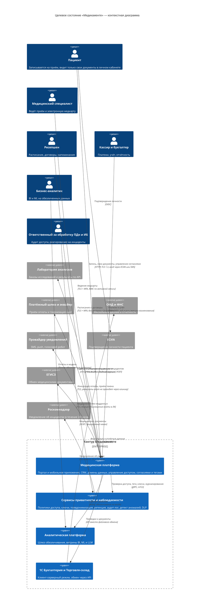

# Целевая архитектура «Медикаменте» по принципам Privacy by Design

Проектирование механизмов управления рисками конфиденциальности **до** реализации изменений: анализ рисков перехода As-Is → To-Be, новые архитектурные блоки, обеспечивающие Privacy by Design, и аналитический слой, работающий с данными без персональных данных.

Исходное состояние и перечень проблемных зон — в [Task1](../Task1/README.md).

---

## 1. Проактивный анализ рисков конфиденциальности

Первый принцип Privacy by Design — предупреждать, а не реагировать. Ниже риски, которые возникнут **при переходе к целевому состоянию** (открытие внешнего контура, филиалы, озеро данных, интеграции), и механизм, который проектируется заранее, чтобы риск не реализовался.

| ID | Риск целевого состояния | Как реализуется без мер | Проектируемый механизм | Блок архитектуры |
|----|-------------------------|-------------------------|------------------------|------------------|
| **R-01** | Вывод ПДн в интернет вместе с порталом и мобильным приложением | Прямой доступ к доменам данных из внешней сети | Единственная точка входа, отсутствие прямого сетевого доступа к контуру данных, WAF и TLS 1.3 | Edge Gateway |
| **R-02** | Пациент получает данные другого пациента (IDOR) | Идентификатор в URL подменяется на чужой | Централизованная проверка `subject.patient_ref == resource.patient_ref` в PDP; непредсказуемые UUID вместо порядковых id; контрактные тесты на чужой идентификатор | PDP + Contract Tests |
| **R-03** | Избыточный сбор данных в новых формах и API | Поле «на всякий случай» добавляется разработчиком | Поле нельзя объявить без указания цели: схема API проверяется на наличие тега и `purpose` | Data Catalog + CI/CD gate |
| **R-04** | Неконтролируемое размножение копий данных в микросервисах | Каждый сервис заводит свою копию пациента | Единый владелец домена, обмен через события с тегами, запрет локальных реплик ПДн | Data Catalog + Lineage |
| **R-05** | Перенос ПДн в озеро данных вместе с аналитикой | Загрузка «как есть» из боевых БД | Обезличивание — обязательный шлюз на входе, боевые ПДн физически не попадают в аналитический контур | Anonymization Gateway |
| **R-06** | Разработчики и подрядчики работают с боевыми данными на стендах | Копия прода на тестовый стенд | Синтетические и маскированные наборы, запрет копирования прода, отдельные ключи сред | Masking Service |
| **R-07** | Партнёр по интеграции получает больше, чем нужно | Контракт отдаёт «всю карточку пациента» | Псевдонимизация в контрактах: наружу уходит `patient_ref` и код услуги, ФИО не покидает клинику; scope на уровне OAuth | Pseudonymization Service |
| **R-08** | Внутренний нарушитель при кратном росте штата | Легитимный доступ используется для массовой выгрузки | Аудит каждого чтения RESTRICTED, детекторы аномалий, разделение обязанностей, запрет экспорта по тегу | Audit Log + Anomaly Detection |
| **R-09** | Невозможность удалить данные по требованию субъекта | Копии в бэкапах и витринах неизвестны | Ретенция из тега, каскадное удаление по `patient_ref`, криптографическое стирание ключа субъекта | Retention & Erasure Service |
| **R-10** | Компрометация ключей шифрования | Ключи в конфигах и коде | Централизованное хранилище с ротацией, отдельный ключ на домен, разделение ролей «владелец данных / владелец ключа» | Key Management |
| **R-11** | ПДн утекают в логи и трассировки | Разработчик логирует объект целиком | Маскирование по тегу в лог-пайплайне, запрет индексации PHI-полей, проверка в CI/CD | Masking Service + CI/CD gate |
| **R-12** | Новый сервис обходит механизмы защиты | Прямое подключение к БД мимо PDP | Fail-closed: нетегированные данные недоступны; доступ к домену только через владельца; сетевая изоляция контура данных | PDP + сегментация |
| **R-13** | ПДн попадают в промпты и веса LLM | Дообучение на «сырых» медкартах | Обучение и промпты только на обезличенных наборах, PII-фильтр на входе и выходе модели | Anonymization Gateway + ML Guardrails |
| **R-14** | Голосовой робот и SMS раскрывают врачебную тайну | В тексте уведомления — диагноз или название исследования | Канал уведомлений не имеет доступа к медданным: передаётся только приглашение войти в ЛК | Notification Service |
| **R-15** | Филиал открывается на «своей» копии системы | Локальный файловый сервер в новом городе | Мультиарендность: филиал — атрибут в ABAC, а не отдельная инсталляция | PDP + доменная модель |

---

## 2. Как принципы Privacy by Design закреплены в архитектуре

Каждый принцип реализован конкретным блоком, а не регламентом — это и есть требование «встроенности в архитектуру».

| Принцип PbD | Архитектурный механизм | Блоки |
|-------------|------------------------|-------|
| **1. Проактивность, а не реактивность** | Риски R-01…R-15 закрыты проектными решениями до разработки; проверки тегов и политик встроены в конвейер сборки | CI/CD Policy Gate |
| **2. Приватность по умолчанию** | Режим fail-closed: нетегированные данные считаются RESTRICTED и недоступны; расширенные поля анкеты выключены по умолчанию; согласие требуется до обработки | Data Catalog, Consent Registry, PDP |
| **3. Приватность встроена в архитектуру** | Доступ невозможен в обход точки принятия решения; ключи и псевдонимы — инфраструктурные сервисы, а не код приложения | PDP, KMS, Pseudonymization |
| **4. Полная функциональность** | Защита не отключает сценарии: врач видит карту при активной записи, аналитик работает с обезличенными витринами, партнёр получает контракт без ФИО | ABAC, Anonymization Gateway |
| **5. Сквозная защита жизненного цикла** | Тег сопровождает данные от формы до витрины и до уничтожения; ретенция и стирание автоматизированы | Data Catalog, Retention & Erasure |
| **6. Прозрачность и подотчётность** | Каждое решение о доступе логируется вместе с тегом ресурса и целью запроса; пациент видит в ЛК свои согласия и историю обращений к его данным | Audit Log, Consent Registry |
| **7. Уважение приватности пользователя** | Пациент управляет согласиями, отзывает их и запрашивает удаление в ЛК; уведомления не раскрывают медданные | Consent Registry, Notification Service |

---

## 3. Контекстная диаграмма целевого состояния (C4, уровень 1)

**Что принципиально изменилось относительно As-Is:**

| As-Is | To-Be |
|-------|-------|
| Пациент взаимодействует только через сотрудника, данные вводятся вручную | Пациент — самостоятельный субъект контекста со своим доступом и управлением согласиями |
| Лаборатория обменивается открытыми письмами | Двусторонняя интеграция по API с псевдонимизацией и подписью |
| Аналитика внутри общего контура на боевых ПДн | Аналитическая платформа — отдельная система, получающая только обезличенные данные |
| Приватность нигде не представлена | Сервисы приватности выделены в отдельную систему контекста |
| Инцидент не обнаруживается | Роскомнадзор появляется как внешний участник обязательного процесса уведомления |
| ККМ и 1С — файловый обмен и OLE | Платёжный шлюз и API-обмен, карточные данные вне периметра |

---

## 4. Новые блоки архитектуры (C4, уровень 2)

Все блоки ниже отсутствуют в As-Is и добавляются именно ради соблюдения Privacy by Design.

```mermaid
C4Container
    title Целевые контейнеры — прикладной контур и сервисы приватности

    Person(patient, "Пациент", "Портал и мобильное приложение")
    Person(staff, "Сотрудник", "Врач, ресепшен, кассир, бухгалтер")
    System_Ext(lab, "Лаборатория", "Внешняя система")
    System_Ext(psp, "Платёжный шлюз", "PCI DSS провайдер")
    System_Ext(notifier, "Провайдер уведомлений", "SMS, push, робот")

    Container_Boundary(edge, "Контур доступа") {
        Container(gw, "Edge Gateway", "API Gateway, WAF", "НОВЫЙ. Единственная точка входа: TLS 1.3, mTLS для партнёров, rate limit, журналирование запросов")
        Container(idp, "Identity Provider", "Keycloak", "НОВЫЙ. Аутентификация пациентов и сотрудников, MFA, step-up для RESTRICTED, OIDC и ЕСИА")
        Container(pdp, "Policy Decision Point", "OPA, Policy as Code", "НОВЫЙ. Единая точка решения о доступе: RBAC, ABAC, проверка цели обработки. Обойти нельзя")
    }

    Container_Boundary(app, "Прикладной контур") {
        Container(portal, "Портал и мобильное приложение", "Web, iOS, Android", "ЛК пациента: запись, свои документы, согласия, запрос на удаление")
        Container(crm, "CRM и рабочее место ресепшена", "Java", "Расписание и договоры без доступа к диагнозам")
        Container(svcmed, "Сервис медданных", "Java", "Домен RESTRICTED: медкарта, результаты, назначения")
        Container(svcappt, "Сервис записи", "Java", "Домен расписания, факт записи как врачебная тайна")
        Container(svcpay, "Сервис платежей", "Java", "Работа с токенами, код услуги вместо наименования")
        Container(svcsign, "Сервис электронной подписи", "УКЭП, 63-ФЗ", "НОВЫЙ. Подпись медицинских документов и проверка подписи лаборатории")
        Container(svcnotify, "Сервис уведомлений", "Java", "НОВЫЙ. Не имеет доступа к медданным: отправляет только приглашение войти в ЛК")
    }

    Container_Boundary(priv, "Контур приватности и наблюдаемости") {
        Container(catalog, "Каталог данных и тегов", "OpenMetadata", "НОВЫЙ. Реестр массивов, теги классификации, Data Lineage, источник правды для политик")
        Container(consent, "Реестр согласий и целей", "Java", "НОВЫЙ. Версии согласий, цели обработки, отзыв, основания по 152-ФЗ")
        Container(pseudo, "Сервис псевдонимизации", "Java", "НОВЫЙ. Выдача patient_ref и хранение таблицы соответствия в изолированном домене")
        Container(mask, "Сервис маскирования", "Java, PostgreSQL Anonymizer", "НОВЫЙ. Маскирование в UI, логах и на тестовых стендах по тегу")
        Container(kms, "Управление ключами", "HashiCorp Vault", "НОВЫЙ. Отдельный ключ на домен, ротация, криптографическое стирание")
        Container(retention, "Сервис ретенции и удаления", "Java", "НОВЫЙ. Сроки из тегов, каскадное удаление по patient_ref, акты об уничтожении")
        Container(audit, "Аудит-лог", "Elasticsearch, append-only", "НОВЫЙ. Кто, что, когда, откуда, зачем, результат, тег ресурса")
        Container(detect, "Детектор аномалий и алертинг", "Victoria Metrics, Grafana", "НОВЫЙ. Массовое чтение карт, доступ без активной записи, выгрузки вне графика")
        Container(dlp, "DLP", "Отечественное решение", "НОВЫЙ. Контроль почты, съёмных носителей и печати")
    }

    Container_Boundary(data, "Контур данных") {
        ContainerDb(dbid, "Домен идентификации", "PostgreSQL", "ФИО и контакты, пополевое шифрование")
        ContainerDb(dbmed, "Домен медданных", "PostgreSQL", "Диагнозы и назначения, отдельный ключ шифрования")
        ContainerDb(dbfin, "Домен финансов", "PostgreSQL", "Токены платежей, коды услуг")
        ContainerDb(obj, "Хранилище документов", "MinIO S3", "Сканы и бланки, SSE-KMS, подписанные ссылки")
        ContainerQueue(bus, "Шина событий", "Kafka", "Теги классификации в заголовках сообщений")
    }

    Rel(patient, gw, "HTTPS TLS 1.3")
    Rel(staff, gw, "HTTPS TLS 1.3 + MFA")
    Rel(lab, gw, "mTLS + OAuth 2.0")
    Rel(gw, idp, "Проверка токена", "OIDC")
    Rel(gw, pdp, "Решение о доступе", "gRPC")
    Rel(pdp, catalog, "Теги ресурса определяют политику")
    Rel(pdp, consent, "Проверка основания и цели обработки")
    Rel(gw, portal, "Маршрутизация")
    Rel(gw, crm, "Маршрутизация")
    Rel(gw, svcmed, "Только после решения PDP")
    Rel(gw, svcappt, "Только после решения PDP")
    Rel(gw, svcpay, "Только после решения PDP")
    Rel(svcmed, dbmed, "Чтение и запись", "Шифрование пополевое")
    Rel(svcmed, obj, "Документы по подписанной ссылке")
    Rel(svcmed, svcsign, "Подпись и проверка УКЭП")
    Rel(svcappt, dbid, "Идентификация пациента")
    Rel(svcpay, dbfin, "Токены и суммы")
    Rel(svcpay, psp, "Оплата", "Реквизиты карт вне периметра")
    Rel(svcmed, pseudo, "Получение patient_ref для внешних контрактов")
    Rel(svcnotify, notifier, "Уведомление без медданных")
    Rel(svcmed, bus, "События домена с тегами")
    Rel(svcappt, bus, "События домена с тегами")
    Rel(dbmed, kms, "Ключи шифрования домена")
    Rel(dbid, kms, "Ключи шифрования домена")
    Rel(retention, dbmed, "Удаление по истечении срока и по запросу субъекта")
    Rel(retention, kms, "Криптографическое стирание ключа субъекта")
    Rel(consent, retention, "Отзыв согласия запускает прекращение обработки")
    Rel(pdp, audit, "Каждое решение allow и deny")
    Rel(svcmed, audit, "Каждое чтение RESTRICTED")
    Rel(mask, audit, "Маскирование ПДн в логах")
    Rel(audit, detect, "Поток событий для поиска аномалий")
    Rel(dlp, audit, "События каналов утечки")

    UpdateLayoutConfig($c4ShapeInRow="3", $c4BoundaryInRow="2")
```

### Назначение новых блоков

| Блок | Какой риск закрывает | Ключевое свойство |
|------|----------------------|-------------------|
| **Edge Gateway** | R-01 | Единственная точка входа; прямого сетевого пути к контуру данных не существует |
| **Identity Provider** | R-02, R-08 | MFA и step-up аутентификация при обращении к RESTRICTED |
| **Policy Decision Point** | R-02, R-12, R-15 | Решение о доступе принимается централизованно и всегда логируется; политики версионируются в Git |
| **Каталог данных и тегов** | R-03, R-04 | Источник правды о классификации; режим fail-closed для нетегированных данных |
| **Реестр согласий и целей** | R-03 | Проверка основания обработки перед каждой операцией; отзыв согласия исполним технически |
| **Сервис псевдонимизации** | R-05, R-07 | ФИО не покидает клинику: наружу и в аналитику уходит `patient_ref` |
| **Сервис маскирования** | R-06, R-11 | Одни данные, разные представления для ролей, логов и тестовых сред |
| **Управление ключами** | R-10, R-09 | Отдельный ключ на домен и на субъекта; уничтожение ключа стирает данные в том числе в бэкапах |
| **Сервис ретенции и удаления** | R-09 | Сроки хранения исполняются автоматически, дифференцированно по целям обработки |
| **Аудит-лог** | R-08 | Append-only, доступен роли аудитора, включает тег ресурса и цель запроса |
| **Детектор аномалий** | R-08 | Обнаружение нетипичного доступа и запуск процедуры уведомления РКН |
| **DLP** | R-06, R-08 | Контроль каналов, через которые данные уходили в As-Is |
| **Сервис электронной подписи** | Целостность | Юридическая значимость медицинских документов и проверка подписи лаборатории |
| **Сервис уведомлений** | R-14 | Архитектурно не имеет доступа к домену медданных |

---

## 5. Аналитический слой с учётом Privacy by Design

Требование задания — слой, обеспечивающий аналитическую работу с данными системы по принципам PbD. Ключевое проектное решение: **персональные данные не пересекают границу аналитического контура**. Обезличивание выполняется на входе, а не при выдаче отчёта.

```mermaid
C4Container
    title Аналитический слой: обезличивание как обязательный шлюз

    Person(analyst, "Бизнес-аналитик", "P&L, ABC-анализ, отчётность")
    Person(ds, "Data scientist", "ML-модели и LLM-сервисы")
    Person(dpo, "Ответственный за ПДн", "Согласование доступа к сырым данным")

    Container_Boundary(src, "Контур данных: боевые ПДн") {
        ContainerQueue(bus, "Шина событий", "Kafka", "События доменов с тегами классификации")
        ContainerDb(dbmed, "Домены данных", "PostgreSQL", "Идентификация, медданные, финансы")
    }

    Container_Boundary(gate, "Шлюз обезличивания: единственный путь в аналитику") {
        Container(g1, "Замена идентификаторов", "Java", "ФИО, телефон, e-mail, СНИЛС меняются на patient_ref по приказу РКН № 178")
        Container(g2, "Изменение состава и семантики", "Java", "Дата рождения в возрастную группу, адрес в район, время визита в интервал")
        Container(g3, "Декомпозиция и удаление квази-идентификаторов", "Java", "Разрыв связок, позволяющих реидентификацию")
        Container(g4, "Контроль k-анонимности", "Java", "Агрегат не публикуется при k меньше 5; для чувствительных срезов дифференциальная приватность")
        Container(g5, "Генератор синтетических данных", "Java", "Наборы для разработки, тестирования и обучения моделей")
    }

    Container_Boundary(lake, "Аналитический контур: персональных данных нет") {
        ContainerDb(ch, "Витрины данных", "ClickHouse", "Только обезличенные наборы, тег INTERNAL")
        Container(bi, "BI и отчётность", "Grafana, Jupyter", "P&L, ABC-анализ, загрузка филиалов")
        Container(ml, "ML и LLM-сервисы", "Python, Java", "Обучение только на обезличенных и синтетических данных")
        Container(guard, "Guardrails для моделей", "Java", "PII-фильтр на входе и выходе, запрет подачи медданных в промпты")
    }

    Container(raw, "Процедура доступа к сырым данным", "Регламент + PDP", "Исключение: обоснование, согласование, ограниченный срок, полный аудит")
    Container(audit, "Аудит-лог", "Elasticsearch", "Фиксирует и обезличивание, и любой доступ к витринам")

    Rel(dbmed, bus, "Изменения доменов", "CDC")
    Rel(bus, g1, "События с тегами")
    Rel(g1, g2, "")
    Rel(g2, g3, "")
    Rel(g3, g4, "")
    Rel(g4, ch, "Публикация витрины", "Классификация понижается явным решением")
    Rel(g1, g5, "Профиль распределений без ПДн")
    Rel(g5, ml, "Синтетические обучающие наборы")
    Rel(ch, bi, "Чтение витрин", "Роль analyst")
    Rel(ch, ml, "Обучающие выборки")
    Rel(ml, guard, "Запросы и ответы моделей")
    Rel(analyst, bi, "Отчёты")
    Rel(ds, ml, "Разработка моделей")
    Rel(dpo, raw, "Согласование исключений")
    Rel(raw, dbmed, "Ограниченный по времени доступ")
    Rel(raw, audit, "Полный след обращения")
    Rel(g1, audit, "Журнал обезличивания")
    Rel(ch, audit, "Журнал доступа к витринам")

    UpdateLayoutConfig($c4ShapeInRow="3", $c4BoundaryInRow="1")
```

### Правила аналитического слоя

| Правило | Обоснование |
|---------|-------------|
| **Обезличивание на входе, а не на выходе** | Если ПДн попали в озеро, область утечки расширилась независимо от того, как строится отчёт |
| **Единственный путь загрузки — шлюз обезличивания** | Прямые выгрузки из боевых БД в аналитику запрещены сетевой изоляцией и политиками PDP |
| **Понижение классификации — явное решение** | Витрина получает уровень INTERNAL только после прохождения всех этапов шлюза, с фиксацией применённого метода |
| **Контроль реидентификации** | k-анонимность не ниже 5 по набору «возраст + пол + район + специализация врача»: без этого обезличивание формально, а не фактически |
| **Обучение моделей — на обезличенных и синтетических данных** | Модель, обученная на ПДн, сама становится носителем ПДн и не может быть передана или опубликована |
| **Guardrails для LLM** | PII-фильтр на входе и выходе не даёт медданным попасть в промпт, в лог провайдера или в ответ |
| **Доступ к сырым данным — исключение с процедурой** | Полностью запретить нельзя (расследование инцидента, разбор жалобы), но каждый случай обоснован, ограничен по сроку и полностью проаудирован |
| **Ретенция витрин** | Обезличенные наборы тоже имеют срок жизни: устаревшая витрина удаляется по тегу |

### Как слой обслуживает цель бизнеса №2

| Потребность | Реализация без работы с ПДн |
|-------------|------------------------------|
| P&L, ABC-анализ, загрузка специалистов | Агрегаты по кодам услуг и подразделениям — идентификация пациента не требуется |
| Прогноз спроса и планирование филиалов | Возрастные группы и районы вместо точных дат рождения и адресов |
| ML: предсказание неявок на приём | Признаки поведения по `patient_ref` без раскрытия личности |
| LLM: помощник по внутренней базе знаний | Обучение на регламентах и обезличенных кейсах, guardrails на входе и выходе |
| Разработка и тестирование | Синтетические наборы вместо копии прода |

---

## 6. Что должно измениться в процессе разработки

Privacy by Design работает, только если механизмы нельзя обойти во время реализации.

| Контроль | Когда срабатывает | Что блокирует |
|----------|-------------------|---------------|
| Оценка влияния на приватность (DPIA) | Проектирование нового сервиса или интеграции | Запуск без анализа состава данных, целей и оснований |
| Проверка тегов в миграциях БД | Сборка | Колонку без тега классификации |
| Проверка API-контрактов | Сборка | Поле RESTRICTED, отдаваемое без проверки в PDP |
| Проверка логирования | Сборка | Вывод поля с тегом PII или PHI в лог |
| Контрактные тесты на чужой идентификатор | Тестирование | Возможность получить данные другого пациента |
| Проверка тестовых данных | Тестирование | Боевые ПДн в фикстурах |
| Ресертификация прав доступа | Ежеквартально | Накопление избыточных прав у сотрудников |
