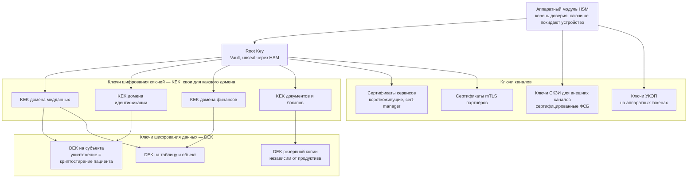
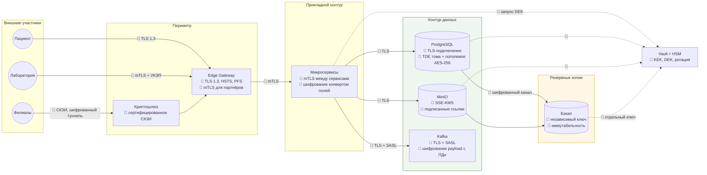

# Стратегия защиты данных «Медикаменте»: Encryption at Rest and In Transit

Классификация данных по состоянию, чувствительности и профилю риска; обоснование защиты каждого класса; инструменты защиты, средства автоматизированного контроля и реестр программных и аппаратных средств.

Основано на состоянии As-Is из [Task1](../Task1/README.md) и целевой архитектуре из [Task2](../Task2/README.md).

---

## 1. Модель классификации данных

Данные классифицируются одновременно по пяти осям — только их сочетание определяет требуемый режим криптозащиты.

| Ось классификации | Значения | Что определяет |
|-------------------|----------|----------------|
| **Состояние** | At Rest — в хранилище; In Transit — при передаче; In Use — в обработке | Какой механизм применим: шифрование тома и поля, TLS, маскирование |
| **Чувствительность** | PUBLIC · INTERNAL · CONFIDENTIAL · RESTRICTED | Стойкость алгоритма, гранулярность ключа, необходимость сертифицированного СКЗИ |
| **Профиль риска** | Вероятность × ущерб; основной вектор угрозы | Приоритет внедрения и глубину эшелонирования |
| **Правовой режим** | Спецкатегория ПДн (ст. 10 152-ФЗ), врачебная тайна (ст. 13 323-ФЗ), иные ПДн, фискальные (54-ФЗ), кадровые, коммерческая тайна | Обязательность сертифицированных СКЗИ, локализацию, срок хранения |
| **Криптопериод** | Срок жизни ключа и срок хранения данных | Частоту ротации и стратегию перешифрования |

### 1.1 Классы данных

| Класс | Данные | Состояние | Чувстви­тельность | Правовой режим | Профиль риска | Требуемая криптозащита |
|-------|--------|-----------|------------------|----------------|---------------|------------------------|
| **К1** | Диагнозы, анамнез, результаты анализов, заключения, назначения | Rest, Transit, Use | RESTRICTED | Спецкатегория ПДн + врачебная тайна | 🔴 25 — инсайдер, кража носителя, перехват канала с лабораторией | Пополевое шифрование AES-256-GCM, отдельный ключ домена и субъекта, TLS 1.3 + mTLS, сертифицированное СКЗИ на внешних каналах, УКЭП |
| **К2** | Факт и время записи к специалисту, специализация врача | Rest, Transit | RESTRICTED | Врачебная тайна | 🔴 20 — раскрытие через расписание, календари, чеки | Пополевое шифрование, TLS 1.3, маскирование для немедицинских ролей |
| **К3** | ФИО, дата рождения, контакты, адрес, СНИЛС, паспортные данные | Rest, Transit, Use | CONFIDENTIAL | Иные ПДн | 🔴 20 — массовая выгрузка базы | Пополевое шифрование AES-256, TLS 1.3, хеширование для поиска и дедупликации |
| **К4** | Платёжные данные: токены, суммы, коды услуг | Rest, Transit | CONFIDENTIAL | ПДн + фискальные данные, PCI DSS | 🟠 16 — перехват в канале ККМ, мошенничество | Токенизация вместо хранения реквизитов, TLS 1.3 до шлюза и ККМ, шифрование БД |
| **К5** | Согласия, ИДС, договоры | Rest, Transit | CONFIDENTIAL | Основание обработки по 152-ФЗ | 🟠 15 — оспаривание законности обработки | Шифрование, ЭП пациента, контроль целостности |
| **К6** | Кадровые данные и зарплата | Rest, Transit | CONFIDENTIAL | ПДн работников (гл. 14 ТК РФ) | 🟠 16 — копирование базы 1С | Шифрование БД и тома, TLS, ролевой доступ в 1С |
| **К7** | Учётные данные, ключи, сертификаты, секреты | Rest, Transit, Use | RESTRICTED | Средства защиты | 🔴 25 — компрометация обесценивает всю защиту | Хранилище секретов, аппаратный корень доверия, хеширование Argon2id, ротация |
| **К8** | Аудит-логи и журналы доступа | Rest, Transit | CONFIDENTIAL | Доказательная база по ст. 19 152-ФЗ | 🟠 15 — подчистка следов нарушителем | Шифрование, append-only, контроль целостности хешированием |
| **К9** | Резервные копии всех классов | Rest, Transit | По максимуму источника | Наследует режим источника | 🔴 20 — кража копии обходит всю защиту прода | Шифрование копии независимым ключом, иммутабельность, шифрование канала выгрузки |
| **К10** | Обезличенные витрины BI и ML | Rest, Transit | INTERNAL | Не ПДн после обезличивания | 🟡 9 — риск реидентификации при слабом обезличивании | Шифрование тома, TLS, контроль k-анонимности |
| **К11** | ТМЦ, поставщики, закупки | Rest, Transit | INTERNAL | Коммерческая тайна | 🟡 9 — утечка условий закупок | Шифрование тома, TLS |
| **К12** | Публичная информация: прайс, адреса, расписание работы | Rest, Transit | PUBLIC | — | 🟢 4 — подмена контента | Шифрование не требуется; TLS и контроль целостности |

### 1.2 Матрица «состояние → механизм»

| Состояние | Что реально угрожает | Механизм защиты | Чего механизм **не** закрывает |
|-----------|----------------------|-----------------|--------------------------------|
| **At Rest — том и диск** | Кража сервера или диска, утилизация носителя, доступ к резервной копии | Шифрование тома, аппаратное шифрование СХД, TPM | Ничего не даёт против доступа при работающей системе: для ОС данные уже расшифрованы |
| **At Rest — СУБД** | Копирование файлов БД, доступ администратора к файловой системе | Прозрачное шифрование БД, шифрование табличных пространств | Не защищает от привилегированного пользователя СУБД |
| **At Rest — поле или объект** | Инсайдер с легитимным доступом к БД, компрометация приложения, выгрузка дампа | **Пополевое шифрование конвертом**: DEK на домен и субъекта, KEK в хранилище ключей | Не защищает данные в момент обработки в памяти приложения |
| **In Transit — внешние каналы** | Перехват на канале с лабораторией, между филиалами, в интернете | TLS 1.3, mTLS, сертифицированное СКЗИ, VPN или криптошлюз | Не защищает от скомпрометированной стороны обмена |
| **In Transit — внутренние каналы** | Перехват в локальной сети, атака на канал ККМ ↔ 1С, доступ к шине событий | mTLS между сервисами, TLS для СУБД и Kafka, отказ от SMBv1, plain SMTP и OLE | Не заменяет авторизацию: шифрование канала не проверяет право на данные |
| **In Use** | Утечка через логи, дампы памяти, экраны, экспорт в отчёты, тестовые стенды | Маскирование по тегу, минимизация в памяти, запрет дампов, синтетика на стендах | Не защищает от легитимного пользователя, злоупотребляющего правами — нужен аудит |

**Ключевой вывод:** ни один уровень не самодостаточен. Шифрование тома защищает от кражи железа, но не от инсайдера; пополевое шифрование защищает от инсайдера, но не от компрометации приложения. Поэтому уровни применяются совместно и с разными владельцами ключей.

---

## 2. Данные, необходимость защиты и инструменты

Основная таблица в формате из задания.

| Данные | В чём необходимость защиты | Инструменты защиты |
|--------|----------------------------|--------------------|
| **К1. Медицинские данные: диагнозы, анализы, заключения** | Спецкатегория ПДн (ст. 10 152-ФЗ) и врачебная тайна (ст. 13 323-ФЗ). Раскрытие причиняет наибольший вред субъекту, необратимо и влечёт штраф до 15 млн ₽, иски пациентов и ст. 272.1 УК РФ. Обрабатываются 15 медицинскими специалистами и передаются внешнему контрагенту | **At rest:** пополевое AES-256-GCM в PostgreSQL, отдельный ключ домена и ключ субъекта, шифрование тома LUKS/BitLocker, объекты в MinIO с SSE-KMS. **In transit:** TLS 1.3 наружу, mTLS между сервисами, сертифицированное СКЗИ на канале с лабораторией и ЕГИСЗ. **Целостность:** УКЭП врача и лаборатории по 63-ФЗ и приказу МЗ № 947н. **In use:** ABAC по активной записи, маскирование для немедицинских ролей, аудит каждого чтения |
| **К2. Факт и время записи к специалисту** | Сам факт обращения отнесён к врачебной тайне ст. 13 323-ФЗ. В As-Is раскрывается через Excel-журнал, календари Outlook и чеки ККМ, то есть доступен всему офису | Пополевое шифрование, TLS 1.3, маскирование расписания для ролей вне медперсонала, замена наименования услуги на код в чеке и реестре кассира |
| **К3. Идентификационные ПДн пациента** | Основной объект массовой утечки: база контактов пациентов клиники — товар на теневом рынке. Обязательные меры по ст. 19 152-ФЗ и УЗ по ПП № 1119 | Пополевое AES-256, шифрование тома, TLS 1.3, хеширование телефона и e-mail для поиска без расшифрования, маскирование в UI и логах, запрет экспорта по тегу |
| **К4. Платёжные данные** | Реквизиты карт подпадают под PCI DSS; фискальные данные — под 54-ФЗ. Канал ККМ ↔ 1С в As-Is идёт по OLE поверх TCP/IP без шифрования | Токенизация на стороне платёжного шлюза — реквизиты не попадают в системы клиники и выводят компанию из области действия PCI DSS; TLS до ККМ вместо OLE; шифрование БД финансового домена |
| **К5. Согласия, ИДС, договоры** | Документальное основание законности обработки. Утрата или подмена означает невозможность доказать соответствие 152-ФЗ при проверке | Шифрование хранилища документов, простая ЭП пациента через ЛК, хеш-цепочка версий согласий, контроль целостности |
| **К6. Кадровые данные и зарплата** | ПДн работников; в As-Is файловая база `.1CD` копируется целиком одним действием без следов | Перевод 1С в клиент-серверный режим на PostgreSQL с шифрованием тома и TDE, TLS-подключения, ролевые права внутри 1С, аудит выгрузок |
| **К7. Ключи, секреты, учётные данные** | Компрометация обесценивает всю остальную криптозащиту: ключ даёт доступ ко всем зашифрованным данным сразу | Хранилище секретов Vault, аппаратный модуль HSM как корень доверия, TPM на серверах, аппаратные токены для УКЭП и администраторов, Argon2id для паролей, ротация 90 дней, разделение ролей «владелец данных / владелец ключа» |
| **К8. Аудит-логи** | Единственная доказательная база при расследовании и при проверке РКН. Первое действие нарушителя — подчистить журнал | Append-only индексы, шифрование хранилища, контроль целостности хешированием, отдельные права роли `auditor`, репликация в изолированный контур |
| **К9. Резервные копии** | Копия содержит те же данные, но обычно защищена хуже: кража бэкапа обходит всю защиту продуктива. При этом бэкап нужен против шифровальщика | Шифрование копии независимым ключом, иммутабельные копии, офлайн-копия по схеме 3-2-1, шифрование канала выгрузки, регулярные тесты восстановления |
| **К10. Обезличенные витрины BI и ML** | Формально не ПДн, но при слабом обезличивании возможна реидентификация по квази-идентификаторам; модель, обученная на ПДн, сама становится их носителем | Шифрование тома ClickHouse, TLS, контроль k-анонимности не ниже 5, разделение схем `raw` и `anonymized`, guardrails с PII-фильтром для LLM |
| **К11. ТМЦ, поставщики, закупки** | Коммерческая тайна; в связке с записью на приём косвенно раскрывает диагноз через списание препаратов узкого профиля | Шифрование тома, TLS, разрыв связи «препарат ↔ пациент» при выгрузке в аналитику |
| **К12. Публичные данные** | Конфиденциальность не требуется, но нужна защита от подмены контента и фишинга | TLS 1.3 с HSTS, контроль целостности, WAF |

---

## 3. Иерархия ключей и криптопериоды

| Ключ | Криптопериод | Ротация | Особенности |
|------|--------------|---------|-------------|
| Root Key | 3 года | Плановая, с церемонией | Unseal только через HSM, разделение секрета между несколькими держателями |
| KEK домена | 1 год | Плановая, перешифрование DEK | Разные ключи у разных доменов — компрометация одного не раскрывает пациента целиком |
| DEK таблицы и объекта | 1 год | При ротации KEK | Шифрование конвертом: сам DEK хранится рядом с данными в зашифрованном виде |
| **DEK субъекта** | Срок хранения медкарты — 25 лет | При запросе на удаление — **уничтожение** | Механизм криптографического стирания: уничтожение ключа делает данные нечитаемыми в том числе в резервных копиях |
| Сертификаты сервисов | 90 дней и менее | Автоматическая | Выпуск и продление через cert-manager, отзыв через CRL/OCSP |
| Сертификаты партнёров mTLS | 1 год | Плановая с уведомлением | Индивидуальный сертификат на каждого контрагента |
| Ключи СКЗИ внешних каналов | По регламенту эксплуатации СКЗИ | По регламенту | Журнал учёта СКЗИ и ключевых носителей обязателен |
| Ключи УКЭП | 1 год (сертификат) | Плановая | Только на аппаратных носителях, извлечение запрещено |
| Пароли сервисных учётных записей | 90 дней | Автоматическая | Выдача через Vault, в конфигурациях не хранятся |

**О сертифицированных СКЗИ.** Криптография, применяемая как мера защиты ПДн, должна пройти оценку соответствия (ст. 19 152-ФЗ, приказ ФСБ № 378). Практическое разделение:

| Канал | Требование |
|-------|------------|
| Передача ПДн по каналам за пределы контролируемой зоны: интернет, филиалы, лаборатория, ЕГИСЗ, ЕСИА | **Сертифицированные СКЗИ**, ГОСТ Р 34.12-2015 «Кузнечик», ГОСТ Р 34.10-2012 для подписи, TLS с ГОСТ-наборами. Класс СКЗИ — КС1 и выше для УЗ-3, КС2 и выше для УЗ-2, уточняется моделью нарушителя |
| Внутренние каналы в контролируемой зоне и шифрование при хранении | Допустимы стандартные реализации AES-256-GCM и TLS 1.3; сертификация требуется, если криптозащита заявлена как основная мера нейтрализации угрозы в модели угроз |

Точный класс СКЗИ определяется после разработки модели угроз и присвоения уровня защищённости по ПП № 1119 — это первое мероприятие дорожной карты из Task 1.

---

## 4. Карта шифрования по контурам

**Что запрещается архитектурно:** TLS ниже 1.2, SMBv1 и SMB без подписи, открытый SMTP для медданных, OLE поверх TCP/IP между ККМ и 1С, файловый режим 1С на общей папке, незашифрованные резервные копии, ключи в конфигурационных файлах и репозиториях кода.

---

## 5. Автоматизированный контроль

Криптозащита деградирует незаметно: истекает сертификат, разработчик добавляет поле без шифрования, поднимается сервис с TLS 1.0. Контроль должен быть непрерывным и автоматическим.

| Что контролируется | Средство контроля | Периодичность | Реакция на нарушение |
|--------------------|-------------------|---------------|----------------------|
| Появление незащищённых ПДн в хранилищах и почте | Сканер классификации Data Discovery: регулярные выражения на СНИЛС, ИНН, телефон, коды МКБ, словари, ML-классификатор | Непрерывно для новых объектов, полное сканирование еженедельно | Автотегирование, алерт владельцу домена, блокировка доступа до классификации |
| Шифрование полей класса RESTRICTED | Проверка миграций БД в конвейере сборки: колонка с тегом PHI обязана иметь шифрование | Каждая сборка | Блокировка релиза |
| Отсутствие ПДн в логах и трассировках | Линтер на вывод полей с тегом PII и PHI, маскирующий фильтр в лог-пайплайне | Каждая сборка и в рантайме | Блокировка релиза, маскирование на лету |
| Конфигурация TLS на всех эндпоинтах | Сканер TLS: версия протокола, шифронаборы, PFS, длина ключа, цепочка доверия | Ежедневно | Алерт, автоматическое закрытие эндпоинта при TLS ниже 1.2 |
| Сроки действия сертификатов | Мониторинг цепочек и OCSP, автопродление через cert-manager | Ежечасно | Алерты за 30, 14 и 7 дней; автопродление коротких сертификатов |
| Незашифрованный трафик в сети | Анализ сетевых потоков и IDS: обнаружение plain SMTP, SMB без подписи, HTTP с ПДн | Непрерывно | Алерт в SIEM, блокировка на межсетевом экране |
| Доступ к ключам и операции с ними | Аудит хранилища секретов: кто запрашивал DEK, сколько раз, из какого сервиса | Непрерывно | Алерт на аномальный объём запросов ключей |
| Соблюдение криптопериодов | Отчёт по возрасту ключей и сертификатов | Еженедельно | Автоматический запуск ротации, эскалация при просрочке |
| Шифрование и восстановимость резервных копий | Проверка признака шифрования копии, тестовое восстановление с замером RTO и RPO | Копии — ежедневно, восстановление — ежемесячно | Инцидент при неудачном восстановлении |
| Целостность аудит-логов | Хеш-цепочка записей, сверка контрольных сумм | Ежедневно | Инцидент ИБ высшего приоритета |
| Каналы утечки: почта, съёмные носители, печать, мессенджеры | DLP с правилами по тегам классификации | Непрерывно | Блокировка передачи, уведомление офицера ИБ |
| Аномальный доступ к зашифрованным данным | Корреляция в SIEM: массовые расшифрования, доступ вне графика, обращение без активной записи | Непрерывно | Алерт дежурной смене, блокировка учётной записи |
| Уязвимости в криптобиблиотеках и образах | Сканер зависимостей и образов контейнеров | Каждая сборка и ежедневно для реестра | Блокировка развёртывания при критической уязвимости |
| Соответствие фактической конфигурации проектной | Проверка политик как кода в конвейере | Каждая сборка | Блокировка развёртывания |

### Метрики контроля

| Метрика | Целевое значение |
|---------|------------------|
| Доля данных класса RESTRICTED с пополевым шифрованием | 100 % |
| Доля данных класса CONFIDENTIAL с шифрованием при хранении | 100 % |
| Доля каналов передачи ПДн с TLS 1.3 или сертифицированным СКЗИ | 100 % |
| Эндпоинты с TLS ниже 1.2 | 0 |
| Сертификаты с истекшим сроком в продуктиве | 0 |
| Ключей за пределами криптопериода | 0 |
| Резервных копий без шифрования | 0 |
| Успешность тестового восстановления | 100 % |
| Среднее время обнаружения незашифрованного канала | менее 24 часов |
| Доля релизов, прошедших криптопроверки без исключений | не менее 95 % |

---

## 6. Реестр программных и аппаратных средств защиты

### 6.1 Программные средства

| Средство | Класс | Назначение | Где применяется | Данные | Примечание |
|----------|-------|------------|-----------------|--------|------------|
| PostgreSQL + `pgcrypto` | СУБД, криптомодуль | Пополевое шифрование, хеширование | Домены идентификации, медданных, финансов | К1–К6 | Шифрование конвертом с ключом из Vault |
| PostgreSQL Anonymizer | Маскирование | Динамическое маскирование в выдаче | Все домены | К1–К3 | Разные представления для ролей |
| HashiCorp Vault (Transit, KV) | Управление ключами и секретами | Иерархия KEK/DEK, ротация, криптостирание | Все контуры | К7 | Unseal через HSM |
| LUKS / BitLocker | Шифрование тома | Защита от кражи носителя | Серверы, рабочие станции | Все | Ключи в TPM |
| MinIO с SSE-KMS | Объектное хранилище | Шифрование документов и сканов | Хранилище документов | К1, К5 | Доступ только по подписанным ссылкам |
| Keycloak | Аутентификация | MFA, step-up, OIDC, интеграция с ЕСИА | Периметр | К7 | — |
| Open Policy Agent | Авторизация | RBAC и ABAC, политики как код | Периметр | Все | Обязательная точка решения |
| Service mesh (Istio или Linkerd) | Сетевая криптография | mTLS между сервисами, ротация сертификатов | Прикладной контур | Все | Прозрачно для приложений |
| cert-manager + внутренний УЦ | PKI | Выпуск, продление, отзыв сертификатов | Kubernetes | К7 | Короткоживущие сертификаты |
| Apache Kafka с TLS и SASL | Шина событий | Шифрование канала и полезной нагрузки | Контур данных | Все | Теги классификации в заголовках |
| КриптоПро CSP / JCP, ViPNet CSP | Сертифицированное СКЗИ | Криптография по ГОСТ для внешних каналов и ЭП | Внешние интеграции | К1, К5 | Класс уточняется моделью угроз |
| КриптоПро ЭЦП, УКЭП | Электронная подпись | Подпись медицинских документов, проверка подписи лаборатории | Сервис подписи | К1, К5 | 63-ФЗ, приказ МЗ № 947н |
| DLP-система из реестра отечественного ПО | Предотвращение утечек | Контроль почты, носителей, печати, мессенджеров | Рабочие станции, шлюзы | Все | Правила по тегам классификации |
| Elasticsearch с ILM | Журналирование | Append-only аудит-лог, контроль целостности | Контур наблюдаемости | К8 | Отдельный доступ роли аудитора |
| Victoria Metrics + Grafana + Alertmanager | Мониторинг | Метрики криптозащиты, алерты | Контур наблюдаемости | — | Стек команды |
| SIEM (Wazuh или коммерческий аналог) | Корреляция событий | Детект аномалий, расследование инцидентов | Контур наблюдаемости | К8 | Источник для уведомления РКН |
| OpenMetadata | Каталог данных | Теги классификации, Data Lineage | Все контуры | Все | Источник правды для политик |
| Сканер TLS (testssl.sh, sslyze) | Контроль конфигураций | Проверка версий и шифронаборов | Все эндпоинты | — | В конвейере и по расписанию |
| Сканер зависимостей и образов (Trivy) | Управление уязвимостями | Поиск уязвимых криптобиблиотек | CI/CD, реестр образов | — | Блокировка сборки |
| Conftest / OPA в конвейере | Контроль политик | Проверка тегов, шифрования, логирования | CI/CD | Все | Quality gate |
| Средство резервного копирования с шифрованием | Резервирование | Схема 3-2-1, иммутабельные копии | Контур данных | К9 | Независимый ключ шифрования |
| Антивирусная защита из реестра отечественного ПО | Защита конечных точек | Противодействие шифровальщикам и вредоносному ПО | Серверы, рабочие станции | Все | — |

### 6.2 Аппаратные средства

| Средство | Назначение | Где применяется | Обоснование |
|----------|------------|-----------------|-------------|
| **HSM — аппаратный модуль безопасности** | Корень доверия: генерация и хранение мастер-ключей, ключи не покидают устройство | Контур данных, unseal Vault | Программное хранилище ключей уязвимо при компрометации сервера; для К1 и К7 нужен аппаратный корень |
| **Аппаратный криптошлюз** (ViPNet Coordinator, КриптоПро NGate) | Шифрование каналов между филиалами и с внешними системами по ГОСТ | Периметр площадок | Требование приказа ФСБ № 378 к передаче ПДн вне контролируемой зоны; снимает нагрузку с серверов |
| **TPM 2.0 на серверах и рабочих станциях** | Аппаратное хранение ключей шифрования тома, проверка целостности загрузки | Все узлы | Ключ шифрования диска не хранится на самом диске |
| **Аппаратные токены** (Рутокен, JaCarta) | Носители ключей УКЭП и учётных данных администраторов | Врачи, ответственный за ИБ, администраторы | Извлечение ключа невозможно; требование к УКЭП |
| **Аппаратные ключи MFA** (FIDO2) | Второй фактор для привилегированных учётных записей | Администраторы, DPO | Устойчивость к фишингу выше, чем у одноразовых кодов |
| **Межсетевой экран нового поколения (NGFW)** | Сегментация контуров, инспекция трафика, блокировка незашифрованных протоколов | Границы контуров | Реализация сетевой изоляции контура данных |
| **СХД с аппаратным шифрованием дисков** | Шифрование при хранении на уровне массива | Контур данных | Защита при выводе дисков из эксплуатации и при их замене |
| **Ленточная или иммутабельная система хранения копий** | Офлайн-копия по схеме 3-2-1 | Резервное копирование | Единственная защита от шифровальщика с правами администратора |
| **Аппаратный ИБП и климат-контроль серверной, СКУД** | Физическая защита и доступность | Серверная | Доступность — третий элемент триады; в As-Is физическая защита оценена на 2 из 5 |
| **Отдельный сервер или площадка для резервных копий** | Хранение копии вне основного здания | Вторая площадка или аттестованное облако | В As-Is всё в одном здании: пожар уничтожает и данные, и копии |

---

## 7. Порядок внедрения

| Волна | Что внедряется | Закрываемые классы |
|-------|----------------|--------------------|
| **0. Недели 1–4** | Шифрование томов на серверах и рабочих станциях, шифрование резервных копий, отключение SMBv1 и открытого SMTP, включение TLS на существующих сервисах, журнал учёта носителей | К9, частично К1–К6 |
| **1. Месяцы 2–4** | Vault и иерархия ключей, пополевое шифрование доменов при миграции из Excel, mTLS в кластере, TLS-подключения к СУБД, cert-manager | К1–К3, К7 |
| **2. Месяцы 4–8** | Сертифицированные СКЗИ и криптошлюзы для лаборатории, филиалов и ЕГИСЗ, УКЭП, токенизация платежей, DLP | К1, К4, К5 |
| **3. Месяцы 8–12** | HSM как корень доверия, криптографическое стирание по запросу субъекта, полный автоматизированный контроль и метрики, аттестация ИСПДн | К7, К8, К9 |

Внедрение начинается с мероприятия «модель угроз и определение уровня защищённости по ПП № 1119»: без него нельзя обоснованно выбрать класс СКЗИ и объём сертифицированных средств.
