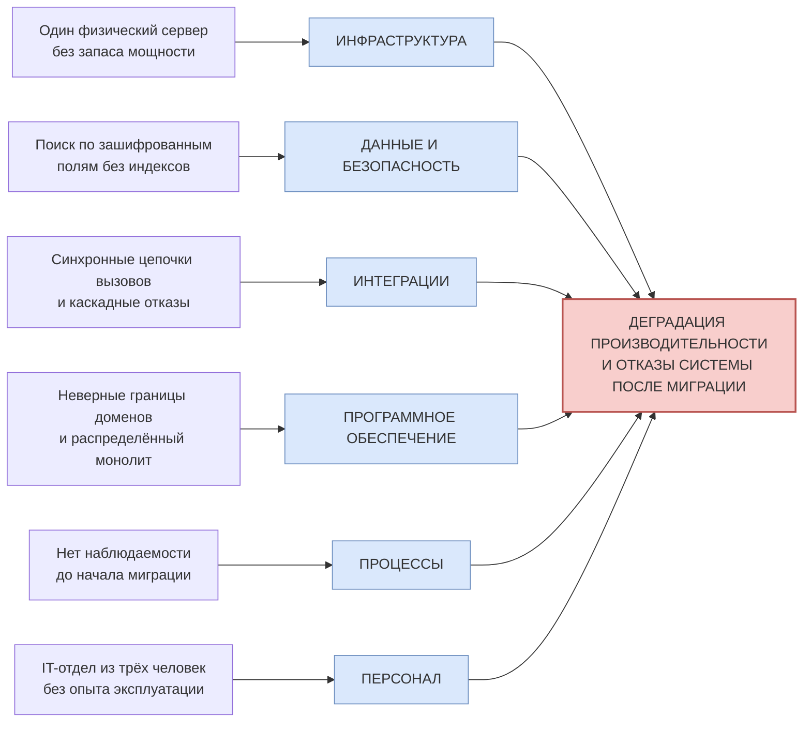

# Task 4. Оценка узких мест при миграции

Анализ рисков снижения производительности и работоспособности при переходе «Медикаменте» от монолитной файловой архитектуры к микросервисной платформе: диаграмма Исикавы, разбор причин по категориям и приоритизированные меры.

## Артефакты

| Файл | Содержание |
|------|------------|
| **[Ishikawa_Migration.drawio](Ishikawa_Migration.drawio)** | **Диаграмма Исикавы** — 6 категорий, 36 потенциальных причин узких мест. Открывается в [app.diagrams.net](https://app.diagrams.net) или расширением Draw.io Integration в VS Code |
| README.md | Отчёт: анализ ситуации, разбор причин с механизмом влияния на производительность, рекомендации с приоритетами, критерии готовности к миграции |

---

## 1. Анализ ситуации

### 1.1 Что мигрирует

| Компонент As-Is | Целевое состояние | Характер миграции |
|-----------------|-------------------|-------------------|
| Журналы записи и учёта в Excel на общем диске | Домены данных в PostgreSQL, сервис записи, портал пациента | Перенос данных с очисткой и классификацией; полная замена способа работы |
| Медкарты в виде сканов JPG/PDF | Электронная медкарта + объектное хранилище с шифрованием | Перенос файлов, распознавание и привязка к пациентам, простановка тегов |
| 1С:Бухгалтерия и 1С:Торговля-склад в файловом режиме | Клиент-серверный режим на PostgreSQL, обмен через API | Смена режима работы СУБД, замена файловой интеграции |
| ККМ через OLE поверх TCP/IP | Платёжный шлюз с токенизацией, TLS до ККМ | Замена протокола, зависимость от вендора кассовой техники |
| Обмен с лабораторией по e-mail | API-интеграция с mTLS, псевдонимизацией и УКЭП | Разработка контракта совместно с внешним контрагентом |
| Файловый сервер, AD, Exchange на одном физическом сервере | Kubernetes, сегментированные контуры, сервисы приватности | Новая инфраструктура, эксплуатируемая параллельно со старой |
| Выгрузки Excel в Jupyter на рабочей станции | Шлюз обезличивания и витрины в ClickHouse | Новый контур, ранее не существовавший |

### 1.2 Цели миграции и вытекающие нагрузочные требования

| Цель | Что означает для производительности |
|------|-------------------------------------|
| Поддержать пятикратный рост объёма данных | Профиль нагрузки для тестирования строится не от текущих значений, а от целевых ×5 |
| Открытие филиалов | Появляется распределённая топология: сетевые задержки между площадками, требования к каналам и их резервированию |
| Портал и мобильное приложение | Внешний трафик от пациентов — непредсказуемый, пиковый, без возможности «попросить подождать» |
| Автоматическая запись и уведомления | Появляются фоновые задачи и пики рассылок, конкурирующие с онлайн-нагрузкой |
| Озеро данных, BI, ML | Аналитическая нагрузка не должна влиять на операционную |
| Требования безопасности из Task 1–3 | Шифрование, проверка политик и аудит добавляют работу **на каждый запрос** — это главный источник новых узких мест |

### 1.3 Ключевая особенность этого случая

Обычная миграция монолита ухудшает производительность за счёт сетевых вызовов между сервисами. Здесь к этому добавляется второй, более значимый фактор: **система одновременно получает контур безопасности, которого раньше не было вообще**. Пополевое шифрование, обращение за ключами, проверка политик доступа и аудит каждого чтения — всё это работа, выполняемая на каждый запрос там, где раньше выполнялось открытие файла Excel. Поэтому категория «Данные и безопасность» вынесена на диаграмме в отдельную кость.

---

## 2. Диаграмма Исикавы

Каноническая диаграмма — в файле [Ishikawa_Migration.drawio](Ishikawa_Migration.drawio). Ниже — схема связей для быстрого просмотра, с наиболее критичной причиной в каждой категории.

---

## 3. Разбор причин по категориям

Для каждой причины указан механизм: **как именно** она превращается в потерю производительности или отказ.

### 3.1 Инфраструктура

| Причина | Механизм влияния | Признак реализации |
|---------|------------------|--------------------|
| Один физический сервер, нет запаса мощности | В переходный период монолит и новая платформа работают параллельно, потребление ресурсов удваивается; Kubernetes добавляет накладные расходы на сам оркестратор | Рост времени отклика при неизменном числе пользователей |
| Нет горизонтального масштабирования и резервирования | Пик нагрузки от мобильного приложения нечем поглотить; отказ узла = отказ системы | Отказ при пиковой записи, недоступность в часы приёма |
| ЛВС офиса не рассчитана на трафик между сервисами | Дробление монолита превращает вызовы внутри процесса в сетевые; mTLS добавляет рукопожатия и шифрование | Рост задержек east-west трафика, потери пакетов |
| Нет резервного канала для филиалов и мобильного приложения | Филиал теряет связь с центральной платформой и не может работать вообще, тогда как раньше работал автономно с локальными файлами | Простой филиала при аварии канала |
| Отсутствует стенд, идентичный продуктиву | Нагрузочное тестирование невозможно, узкие места обнаруживаются на пациентах | Инциденты сразу после релиза |
| Рост IOPS от шифрования тома и аудит-логов | Шифрование добавляет нагрузку на процессор и дисковую подсистему, аудит каждого чтения кратно увеличивает объём записи | Рост латентности дисковых операций, переполнение хранилища логов |

### 3.2 Данные и безопасность

| Причина | Механизм влияния | Что делать |
|---------|------------------|------------|
| **Поиск по зашифрованным полям идёт без индексов** | Пополевое шифрование ФИО и телефона делает обычный индекс бесполезным: поиск пациента на ресепшене превращается в полное сканирование таблицы. При пятикратном росте базы это самая вероятная точка деградации | Слепой индекс: хранить рядом HMAC от нормализованного значения и искать по нему; детерминированное шифрование только для полей поиска; поиск по префиксу через отдельную структуру |
| Обращение к хранилищу ключей на каждый запрос | Сетевой вызов в Vault добавляет задержку к каждой операции и создаёт единую точку отказа: недоступность Vault останавливает всю работу с данными | Шифрование конвертом с кэшированием DEK в памяти сервиса с ограниченным временем жизни, локальный агент вместо удалённого вызова, отказоустойчивый кластер Vault |
| Проверка политик доступа на каждый вызов | Централизованный PDP — обязательный участник каждого запроса; удалённый вызов добавляет задержку и делает PDP критичным компонентом | Размещение PDP рядом с сервисом, политики загружаются локальным бандлом; кэш решений с коротким временем жизни; предвычисление для частых сценариев |
| Аудит каждого чтения кратно увеличивает запись | Одно чтение медкарты порождает несколько записей в журнал; синхронная запись аудита удваивает время отклика | Асинхронная запись через очередь с батчингом, отдельное хранилище журналов, полный аудит только для RESTRICTED |
| Общая база данных у нескольких сервисов | Сохранение общей БД превращает микросервисы в распределённый монолит: блокировки одного сервиса тормозят остальные, схему нельзя менять независимо | База на сервис, обмен через события; данные другого домена — только по API |
| Нет партиционирования при хранении 25 лет | Медкарты хранятся 25 лет, таблицы растут неограниченно, запросы за свежими данными сканируют весь исторический объём | Партиционирование по дате, разделение горячего и холодного слоёв, архивные секции с отдельным хранилищем |
| Качество данных при переносе из Excel | Дубликаты, отсутствие ключей, расхождения между Excel и 1С: миграция затягивается, а некорректные связи создают ошибочные выборки | Профилирование данных до миграции, дедупликация, отчёт о качестве, ручная выверка спорных записей |

### 3.3 Интеграции

| Причина | Механизм влияния | Что делать |
|---------|------------------|------------|
| 1С остаётся узким местом по блокировкам | Даже в клиент-серверном режиме 1С плохо переносит параллельную нагрузку от нескольких филиалов; интеграция через API наследует её ограничения | Асинхронный обмен через очередь, буферизация проводок, отказ от синхронных вызовов 1С в пользовательских сценариях |
| Переход ККМ с OLE на TLS зависит от вендора | Кассовая техника может не поддерживать требуемый протокол: срок миграции определяется третьей стороной | Проверка совместимости до начала работ, план замены оборудования, промежуточный шлюз-адаптер |
| У лаборатории нет готового API и SLA | Внешний контрагент не обязан соблюдать сроки ответа: медленный или недоступный партнёр блокирует сценарии клиники | Асинхронная модель, очередь заказов, тайм-ауты и повторы, деградация до ручного режима |
| Синхронные цепочки вызовов дают каскадные отказы | Замедление одного сервиса распространяется по цепочке и исчерпывает пулы соединений вызывающих | Размыкатель цепи, тайм-ауты на каждом вызове, повторы с джиттером, изоляция пулов |
| Двойная запись в старую и новую систему | В переходный период нагрузка удваивается, а расхождения между системами накапливаются | Захват изменений данных вместо двойной записи, шаблон Outbox, регулярная сверка, жёсткое ограничение срока сосуществования |
| Нет версионирования контрактов | Изменение схемы ломает потребителей, включая внешних партнёров | Версионирование API и схем событий, контрактные тесты, обратная совместимость как правило |

### 3.4 Программное обеспечение и архитектура

| Причина | Механизм влияния | Что делать |
|---------|------------------|------------|
| Неверные границы доменов дают распределённый монолит | Если границы проведены не по доменам, один пользовательский сценарий требует множества межсервисных вызовов: latency складывается, надёжность перемножается | Границы по доменам данных из Task 2; сценарий записи на приём не должен затрагивать более двух-трёх сервисов |
| Разговорчивые сервисы и запросы N+1 | Список приёма на день превращается в сотни вызовов за данными пациентов | Пакетные операции, агрегирующие эндпоинты, денормализация проекций для чтения |
| Нет кэширования и механизма обратного давления | Каждый запрос идёт в БД с расшифрованием; при пике система не отбрасывает лишнюю нагрузку, а деградирует целиком | Кэш справочников и расписания, ограничение частоты запросов, очереди с ограниченной длиной, плавная деградация |
| Распределённые транзакции вместо саг | Попытка сохранить транзакционность монолита в распределённой системе даёт длительные блокировки | Саги с компенсациями, идемпотентность операций, согласованность в конечном счёте там, где допустимо |
| Бизнес-логика 1С воспроизведена не полностью | Скрытые правила расчётов и учёта, не описанные нигде, всплывают после переключения | Инвентаризация правил до миграции, параллельный расчёт и сверка результатов старой и новой систем |
| Нет профилирования и нагрузочных тестов | Узкие места ищутся в продуктиве по жалобам пользователей | Нагрузочное тестирование на профиле ×5 до переключения, профилирование горячих путей |

### 3.5 Процессы

| Причина | Механизм влияния | Что делать |
|---------|------------------|------------|
| Миграция одномоментно вместо поэтапной | Единовременное переключение всех процессов не оставляет возможности локализовать проблему и отступить | Шаблон «удушающего фикуса»: функции выводятся по одной, старый и новый пути сосуществуют за фасадом |
| Нет SLO и приёмочных критериев производительности | Отсутствует определение «достаточно быстро»: спорить о деградации будут по ощущениям | SLO по ключевым сценариям до миграции, приёмочные критерии как условие переключения |
| Нет наблюдаемости и трассировок до миграции | В распределённой системе без сквозной трассировки причина замедления не локализуется | Метрики, логи и трассировки внедряются **до** первого переключения, не после |
| Нет плана отката и репетиции на копии данных | Обнаруженная в продуктиве проблема не имеет обратного хода: клиника не может остановить приём пациентов | План отката для каждого шага, репетиция на копии данных, переключение флагами функциональности |
| Не выполнен расчёт мощности на пятикратный рост | Инфраструктура рассчитана на сегодняшнюю нагрузку и упирается в потолок через несколько месяцев | Расчёт мощности от целевых значений, а не от текущих; запас на пики |
| Миграция в период пиковой нагрузки | Совмещение переключения с сезоном обращений умножает последствия любой ошибки | Окна миграции в периоды низкой нагрузки, заморозка изменений на время переключения |

### 3.6 Персонал

| Причина | Механизм влияния | Что делать |
|---------|------------------|------------|
| IT-отдел из трёх человек | Тот же состав одновременно эксплуатирует старую систему, строит новую и обучает сотрудников: пропускная способность команды становится узким местом проекта | Найм SRE и специалиста по ИБ до начала миграции, привлечение подрядчика на разовые работы |
| Нет опыта эксплуатации Kubernetes в продуктиве | Ошибки конфигурации оркестратора проявляются как случайная деградация, диагностика занимает часы | Обучение до миграции, управляемая платформа вместо самостоятельного развёртывания, поддержка внешней экспертизы на первый период |
| Знания сосредоточены у технического директора | Он же архитектор, он же принимает решения: отпуск или уход останавливает проект | Документирование решений, парная работа, распределение зон ответственности |
| Нет дежурной смены и процесса реагирования | Инцидент в часы приёма обнаруживается пациентами и обрабатывается в порядке аврала | Дежурство на часы работы клиники, регламент реагирования, оповещения из системы мониторинга |
| Найм не успевает за темпом миграции | План строится на людях, которых ещё нет | Планирование этапов от фактической численности; наём — предусловие следующего этапа, а не параллельная задача |
| Сопротивление персонала и возврат к Excel | Если новая система медленнее прежнего Excel, сотрудники возвращаются к теневым файлам, и миграция теряет смысл | Целевое время отклика на ключевых сценариях как приёмочный критерий, обучение, отключение старых каналов только после подтверждения удобства нового |

---

## 4. Рекомендации и приоритеты

Приоритет определяется тем, насколько мера снижает вероятность отказа при переключении и можно ли её выполнить после миграции.

### P0 — до начала миграции (без этого переключаться нельзя)

| Мера | Устраняет причины | Ожидаемый эффект |
|------|-------------------|------------------|
| Внедрить наблюдаемость: метрики, логи, сквозные трассировки, дашборды | 3.5 наблюдаемость, 3.1 стенд | Узкие места видны сразу и локализуются за минуты, а не по жалобам |
| Определить SLO и приёмочные критерии производительности по ключевым сценариям | 3.5 SLO, 3.6 сопротивление персонала | Появляется объективное условие переключения; новая система обязана быть быстрее Excel |
| Выполнить расчёт мощности от целевого профиля ×5 и подготовить стенд, идентичный продуктиву | 3.1 сервер, масштабирование, стенд | Дефицит ресурсов обнаруживается до пациентов |
| Провести нагрузочное тестирование с включённым контуром безопасности | 3.2 все причины | Измеряется реальная стоимость шифрования, PDP и аудита, а не предполагаемая |
| Спроектировать поиск по зашифрованным полям: слепые индексы | 3.2 поиск без индексов | Снимается самая вероятная точка деградации операционных сценариев |
| Принять поэтапную стратегию перехода вместо одномоментной, с планом отката на каждом шаге | 3.5 одномоментность, план отката | Любая проблема ограничена одной функцией и обратима |
| Нанять SRE и специалиста по ИБ, зафиксировать зоны ответственности | 3.6 команда, знания, дежурство | Снимается ограничение пропускной способности команды |
| Профилировать данные Excel и 1С, оценить качество до переноса | 3.2 качество данных, 3.4 логика 1С | Исключается перенос мусора и срыв сроков на этапе миграции |

### P1 — в ходе миграции

| Мера | Устраняет причины | Ожидаемый эффект |
|------|-------------------|------------------|
| Кэшировать ключи шифрования в памяти сервисов, вынести PDP рядом с сервисом | 3.2 ключи, политики | Убираются два сетевых вызова с каждого запроса |
| Перевести аудит в асинхронную запись с батчингом | 3.2 аудит, 3.1 IOPS | Журналирование перестаёт влиять на время отклика |
| Разделить базы по сервисам, обмен через события | 3.2 общая БД, 3.4 границы доменов | Исчезает распределённый монолит и взаимные блокировки |
| Внедрить размыкатели цепи, тайм-ауты, повторы с джиттером, идемпотентность | 3.3 каскадные отказы, лаборатория, ККМ | Отказ внешней системы перестаёт останавливать клинику |
| Заменить двойную запись на захват изменений и Outbox, ввести регулярную сверку | 3.3 двойная запись | Снижается нагрузка переходного периода, расхождения выявляются автоматически |
| Ввести партиционирование, разделение горячих и холодных данных | 3.2 хранение 25 лет | Время выборки перестаёт зависеть от исторического объёма |
| Добавить кэширование, пакетные операции, проекции для чтения | 3.4 N+1, кэш | Убираются массовые мелкие запросы в типовых сценариях |
| Версионировать API и схемы событий, ввести контрактные тесты | 3.3 контракты | Изменения перестают ломать потребителей |
| Организовать дежурство на часы работы клиники и регламент реагирования | 3.6 дежурство | Инциденты обнаруживаются системой, а не пациентами |

### P2 — после переключения

| Мера | Устраняет причины | Ожидаемый эффект |
|------|-------------------|------------------|
| Резервный интернет-канал и вторая площадка | 3.1 каналы, резервирование | Отказ канала или здания перестаёт быть остановкой бизнеса |
| Горизонтальное масштабирование и автоматическое добавление мощностей под пики | 3.1 масштабирование | Готовность к росту нагрузки от филиалов и мобильного приложения |
| Изоляция аналитической нагрузки от операционной | 3.2 аналитика | Тяжёлые отчёты перестают влиять на приём пациентов |
| Регулярные учения по отказу и восстановлению | 3.5 план отката, 3.6 опыт | Проверка реальных, а не заявленных показателей восстановления |
| Оптимизация горячих путей по данным профилирования | 3.4 профилирование | Планомерное снижение задержек на основании измерений |

---

## 5. Критерии готовности к переключению

Формальные условия, без выполнения которых этап миграции не начинается.

| Критерий | Порог |
|----------|-------|
| Нагрузочное тестирование пройдено на профиле ×5 с включённым контуром безопасности | Время отклика ключевых сценариев в пределах SLO |
| Поиск пациента на ресепшене | Не медленнее прежней работы с Excel — иначе персонал вернётся к теневым файлам |
| Сквозная трассировка покрывает мигрируемый сценарий | 100 % вызовов |
| План отката описан и отрепетирован на копии данных | Успешный откат в тестовой среде |
| Сверка данных старой и новой систем | Расхождений по контрольным суммам нет |
| Дежурство и оповещения настроены | Алерты доходят до ответственного за время, не превышающее согласованное |
| Запас ресурсов инфраструктуры на пик | Не менее 40 % при целевой нагрузке |
| Стратегия переключения | Поэтапная, с флагом функциональности и возможностью вернуться на прежний путь |
